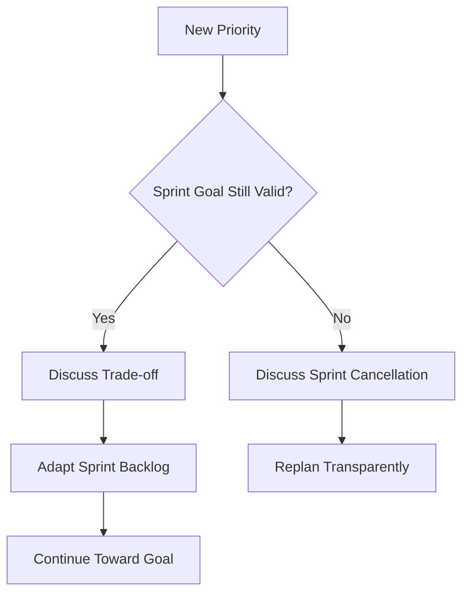

# Product Owner Changes Priorities Mid-Sprint

**Primary Skill:** Coaching + Stakeholder Management

> **Portfolio case study:** This is a realistic simulation intended to demonstrate Scrum Master problem-solving. It should not be presented as a claim of specific client/project experience.

## 1. Scenario

The Product Owner repeatedly approaches Developers during the Sprint with requests to replace planned work with newly prioritized items.

## 2. Business / Delivery Impact

Context switching increases, the Sprint Goal becomes unstable, planned work is carried over, and developers receive conflicting signals.

## 3. What I Would Observe

- Frequent mid-Sprint requests
- Stakeholder pressure
- Poor refinement of upcoming priorities
- Unclear understanding of Sprint Goal flexibility
- Developers accepting requests informally

## 4. Root Cause Analysis

Understand why changes occur before enforcing a rule. Distinguish genuine emergencies from normal priority changes. Inspect whether the Sprint Goal remains valid and make trade-offs transparent.

## 5. Scrum Master's Approach

Coach the Product Owner and Developers on the purpose of the Sprint Goal. Establish a transparent conversation for changes. Improve backlog refinement and stakeholder alignment. If the Sprint Goal remains valuable, adapt the Sprint Backlog collaboratively without compromising the goal. If the goal becomes obsolete, discuss Sprint cancellation with the Product Owner.

## 6. Metrics to Inspect

- Sprint Goal achievement
- Number of mid-Sprint changes
- Carryover
- Context-switching signals
- Unplanned work

## 7. Improvement Experiment

The team would agree on a small, measurable experiment rather than introducing a large process change all at once.

```text
Problem → Hypothesis → Experiment → Measure → Inspect → Adapt
```

## 8. Expected Outcome

Stakeholders understand how to introduce urgent work transparently, while the team retains a clear outcome focus.

## 9. Scrum Master Learning

Protecting a Sprint does not mean protecting every selected Product Backlog item. The Sprint Goal is the central focus.

## 10. Interview Answer

“I would not simply tell the Product Owner that nothing can change. I would understand the reason, assess the impact on the Sprint Goal, facilitate the trade-off with Developers, and improve upstream prioritization.”

## 11. Visual



## 12. Portfolio Takeaway

> **The Scrum Master creates the conditions for the team to solve the problem; the Scrum Master does not become the team's problem solver.**
