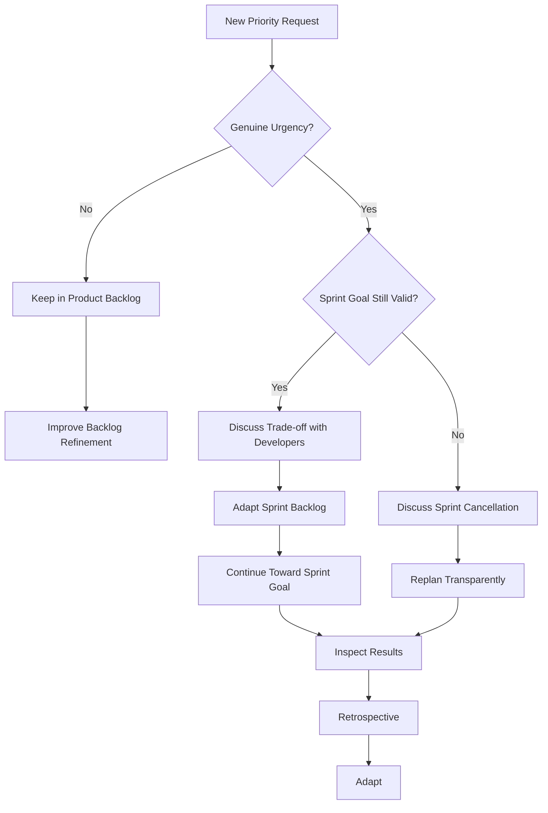

# Product Owner Changes Priorities Mid-Sprint

**Primary Skills:** Coaching • Stakeholder Management • Sprint Goal Protection • Facilitation

> **Portfolio Simulation:** This is a realistic scenario-based simulation created to demonstrate Scrum Master problem-solving and decision-making. It should not be presented as a claim of specific client or project experience.

---

## 1. Scenario

A Product Owner repeatedly approaches Developers during the Sprint with requests to replace planned work with newly prioritized Product Backlog Items.

The Developers begin accepting some requests informally, resulting in frequent context switching and uncertainty about what the team should focus on.

The Scrum Master notices that the issue is not simply that **"the Product Owner is changing priorities."**

The deeper concern is whether the team has a clear **Sprint Goal** and whether changes are being handled transparently without disrupting the team's ability to achieve that goal.

---

## 2. Business / Delivery Impact

Frequent mid-Sprint changes can create several delivery risks:

* Increased context switching
* Reduced focus on the Sprint Goal
* Planned work being carried over
* Increased Work in Progress
* Unplanned work becoming invisible
* Developers receiving conflicting priorities
* Reduced predictability
* Increased risk of unfinished work
* Stakeholder frustration
* Potential quality compromises caused by rushing between priorities

The objective is **not to prevent all change**.

The objective is to ensure that changes are handled transparently while maintaining focus on the Sprint Goal.

---

## 3. What I Would Inspect

Before intervening, I would gather evidence rather than immediately enforcing a process rule.

### Product / Priority Signals

* How frequently are priorities changing?
* Are the changes genuinely urgent?
* Were these items already known during refinement?
* Is there a clear Product Goal?
* Is the Product Backlog sufficiently refined?

### Sprint Signals

* Is there a clear Sprint Goal?
* Does the requested change support the Sprint Goal?
* How much planned work is being replaced?
* How much work is being carried over?
* Is unplanned work increasing?

### Team Signals

* Are Developers accepting requests directly?
* Are Developers comfortable challenging conflicting requests?
* Is context switching affecting flow?
* Are there signs of frustration or confusion?

### Stakeholder Signals

* Are stakeholders bypassing the Product Owner?
* Is the Product Owner receiving pressure from senior stakeholders?
* Are business priorities changing frequently?
* Is there an agreed mechanism for handling genuine emergencies?

---

## 4. Root Cause Analysis

I would avoid immediately labeling the Product Owner's behavior as the root cause.

The priority changes may be a symptom of a larger system problem.

### 1. Weak Upstream Prioritization

Important work is discovered or escalated only after the Sprint begins.

### 2. Poor Backlog Refinement

Upcoming priorities and dependencies are not sufficiently understood before Sprint Planning.

### 3. External Stakeholder Pressure

The Product Owner may be receiving frequent requests from business stakeholders.

### 4. Lack of Sprint Goal Understanding

The team may be treating the Sprint Backlog as a fixed task list rather than focusing on the Sprint Goal.

### 5. Informal Communication Channels

Developers may be accepting requests directly without making the trade-off visible.

### 6. Genuine Emergency Work

Some changes may be legitimate emergencies requiring the team to adapt.

The Scrum Master's role is to **make the system and trade-offs visible**, not simply enforce a "no changes during Sprint" rule.

---

## 5. Scrum Master's Approach

I would approach the situation through **coaching, facilitation, transparency, and inspection**.

### Step 1 — Coach the Product Owner

I would have a one-on-one conversation with the Product Owner.

Instead of saying:

> "You cannot change priorities during the Sprint."

I would ask:

* What is driving these changes?
* Which requests are genuinely urgent?
* Could some of these priorities be identified during refinement?
* How are stakeholders communicating these changes to you?
* Are these changes affecting the Sprint Goal?

The objective is to understand the underlying pressure.

### Step 2 — Re-establish the Sprint Goal

I would facilitate a conversation with the Scrum Team around:

> **"What outcome are we trying to achieve this Sprint?"**

The Sprint Goal becomes the decision-making reference point.

Instead of asking:

> "Can we add this item?"

the team can ask:

> **"Does this help us achieve the Sprint Goal?"**

### Step 3 — Make Trade-offs Visible

If a new priority is genuinely important, I would avoid allowing it to enter the Sprint informally.

Instead, I would facilitate a transparent conversation:

```text
New Priority Request
        ↓
Why is it urgent?
        ↓
Does it support the Sprint Goal?
        ↓
   ┌───────────────┐
   │               │
  YES             NO
   │               │
   ↓               ↓
Discuss           Assess
trade-off         impact
   │               │
   ↓               ↓
Adapt Sprint      Consider whether
Backlog           Sprint Goal remains valid
   │               │
   ↓               ↓
Continue          Discuss next
toward Goal       appropriate action
```

The Developers should be involved in understanding the impact and deciding how the Sprint Backlog can be adapted.

### Step 4 — Protect Developer Focus

I would coach stakeholders and the Product Owner to avoid directly interrupting Developers with competing priorities.

Instead:

Stakeholder
     ↓
Product Owner
     ↓
Transparent discussion with Scrum Team

This does not mean creating bureaucracy.

It creates **transparency around prioritization and trade-offs**.

### Step 5 — Improve Backlog Refinement

If the same pattern keeps occurring, I would investigate upstream.

I would strengthen refinement by discussing:

* Upcoming business priorities
* Dependencies
* Risks
* Expected changes
* Important stakeholder needs
* Potential urgent items
* Product Goal alignment

The goal is to reduce surprises entering the Sprint.

### Step 6 — Handle Genuine Emergencies Differently

Not every change should be treated the same way.

**Normal priority change**

→ Discuss impact
→ Make trade-off visible
→ Adapt Sprint Backlog if appropriate

**Genuine emergency**

→ Assess business impact
→ Discuss with Product Owner and Developers
→ Determine whether the Sprint Goal remains valuable

If the **Sprint Goal becomes obsolete**, the Product Owner has the authority to cancel the Sprint.

The Scrum Master facilitates the conversation and helps the Scrum Team understand the consequences.

---

## 6. Metrics to Inspect

I would use metrics to understand the pattern rather than to evaluate individuals.

| Metric                  | What It Helps Understand                      |
| ----------------------- | --------------------------------------------- |
| Sprint Goal Achievement | Whether the team is maintaining outcome focus |
| Mid-Sprint Changes      | Frequency of priority changes                 |
| Carryover               | Impact on planned work                        |
| Unplanned Work          | Amount of work entering unexpectedly          |
| Work in Progress        | Whether too much work is being started        |
| Cycle Time              | Whether context switching is affecting flow   |
| Blocked Time            | Whether priority changes create delays        |
| Sprint Backlog Churn    | Degree of change during the Sprint            |

> **Important:** Metrics should be used for transparency, inspection, and improvement — not to rank the Product Owner, Developers, or Scrum Master.

---

## 7. Illustrative Example

Consider three Sprints:

| Metric             | Sprint 1 | Sprint 2 | Sprint 3 |
| ------------------ | -------: | -------: | -------: |
| Planned Items      |        8 |        8 |        9 |
| Mid-Sprint Changes |        1 |        3 |        5 |
| Unplanned Items    |        1 |        3 |        4 |
| Carryover Items    |        1 |        2 |        3 |
| Sprint Goal        |        ✅ |       ⚠️ |        ❌ |

### Observation

The important signal is not simply that priorities changed.

The trend suggests:

**Increasing priority changes → increasing unplanned work → increasing carryover → declining Sprint Goal achievement**

This would trigger a deeper conversation about the system causing the changes.

> **These numbers are illustrative examples for the portfolio and are not claims of actual project results.**

---

## 8. Improvement Experiment

Rather than introducing a large process change, I would propose a **one-Sprint improvement experiment**.

### Hypothesis

> If priority changes are made transparent and evaluated against the Sprint Goal, unnecessary context switching will decrease and Sprint Goal focus will improve.

### Experiment

For the next Sprint:

1. Define a clear Sprint Goal.
2. Make all significant mid-Sprint requests visible.
3. Discuss the reason for each request.
4. Assess its impact on the Sprint Goal.
5. Involve Developers in trade-off discussions.
6. Track Sprint Backlog changes.
7. Review the pattern during the Retrospective.

### Improvement Cycle

```text
Problem
   ↓
Hypothesis
   ↓
One-Sprint Experiment
   ↓
Measure
   ↓
Inspect
   ↓
Adapt
```

---

## 9. Illustrative Expected Results

These are **target outcomes for the simulation**, not actual project results.

| Metric                  |       Before | Illustrative Target |
| ----------------------- | -----------: | ------------------: |
| Mid-Sprint Changes      |          3–5 |               ≤ 1–2 |
| Unplanned Work          |    3–4 items |               ≤ 1–2 |
| Carryover               |    2–3 items |                 ≤ 1 |
| Sprint Goal Achievement | Inconsistent |          Consistent |
| Priority Visibility     |          Low |                High |
| Stakeholder Alignment   |     Reactive |      More proactive |

The goal is **not to eliminate change completely**.

The goal is to improve the team's ability to respond to change **without losing outcome focus**.

---

## 10. Definition of Success

I would consider the experiment successful if:

### Delivery

* Sprint Goal achievement improves
* Carryover decreases
* Unplanned work becomes visible
* Context switching reduces

### Collaboration

* Product Owner and Developers discuss trade-offs openly
* Stakeholders understand the impact of mid-Sprint changes
* Developers feel comfortable raising concerns
* Priority decisions become transparent

### Product

* Important priorities are identified earlier
* Backlog refinement becomes more effective
* Product Goal and Sprint Goal remain connected

### Team Behavior

* Developers focus on outcomes rather than individual tasks
* The team takes ownership of Sprint Backlog adaptation
* The Scrum Master is increasingly needed as a facilitator rather than a decision-maker

---

## 11. What I Would Avoid

As Scrum Master, I would **not**:

❌ Tell the Product Owner that "nothing can change during a Sprint."

❌ Treat the Product Owner as the problem.

❌ Allow stakeholders to assign work directly to Developers.

❌ Make the Scrum Master the person who approves every change.

❌ Create unnecessary approval processes.

❌ Use velocity as a performance target.

❌ Blame Developers for carryover.

❌ Blame the Product Owner for changing priorities.

❌ Add meetings simply to control changes.

❌ Optimize for completing more items at the expense of the Sprint Goal.

Instead, I would help the Scrum Team and stakeholders **make the consequences of changes visible and make better decisions together**.

---

## 12. What I Would Learn From the Experiment

After the Sprint, I would inspect:

### If Successful

→ Continue the approach and inspect whether the improvement is sustainable.

### If Partially Successful

→ Identify which constraint is still causing disruption.

### If Unsuccessful

→ Revisit the root-cause hypothesis rather than immediately introducing another process.

Questions I would ask during the Retrospective:

* What caused the priority changes?
* Which changes were genuinely necessary?
* Which could have been identified earlier?
* Did the Sprint Goal help us make decisions?
* Did we make trade-offs transparent?
* Did Developers feel empowered to adapt the Sprint Backlog?
* What should we change next Sprint?

This supports the continuous improvement cycle:

**Inspect → Adapt → Improve**

---

## 13. Scrum Master Skills Demonstrated

| Capability             | Demonstrated Through                                              |
| ---------------------- | ----------------------------------------------------------------- |
| Coaching               | Coaching Product Owner and Developers                             |
| Facilitation           | Facilitating trade-off discussions                                |
| Stakeholder Management | Creating transparency around competing priorities                 |
| Servant Leadership     | Removing systemic friction                                        |
| Systems Thinking       | Looking beyond the visible priority changes                       |
| Data-Driven Thinking   | Using flow and Sprint metrics                                     |
| Conflict Prevention    | Creating a safe environment for trade-offs                        |
| Scrum Knowledge        | Sprint Goal, Sprint Backlog, Product Backlog, Sprint cancellation |
| Continuous Improvement | One-Sprint improvement experiment                                 |
| Team Empowerment       | Helping Developers own Sprint Backlog adaptation                  |

---

## 14. Interview Answer

### Question

**"What would you do if your Product Owner keeps changing priorities in the middle of every Sprint?"**

### Answer

> "I wouldn't immediately tell the Product Owner that changes are not allowed during the Sprint. First, I would understand why the priorities are changing and whether they represent genuine business urgency or a refinement and stakeholder-alignment problem.
>
> I would then bring the conversation back to the Sprint Goal. If the Sprint Goal is still valuable, I would facilitate a transparent discussion with the Product Owner and Developers about the trade-offs and allow the Sprint Backlog to be adapted accordingly.
>
> If the Sprint Goal has become obsolete, I would facilitate a discussion with the Product Owner about whether cancelling the Sprint is appropriate.
>
> In parallel, I would inspect the pattern through metrics such as Sprint Goal achievement, carryover, unplanned work, and Sprint Backlog changes. If the issue is recurring, I would work with the Product Owner and stakeholders to improve backlog refinement and upstream prioritization.
>
> My goal would not be to prevent change. It would be to help the team respond to change transparently while maintaining focus on the Sprint Goal."

---

## 15. Visual Decision Framework



---

## 📌 Portfolio Simulation

> **Scenario-based case study — not a claim of specific client, employer, or production experience.**
>
> This simulation demonstrates how I would approach a Product Owner repeatedly changing priorities during a Sprint. The metrics and outcomes presented are illustrative and are intended to demonstrate my Scrum Master problem-solving approach.