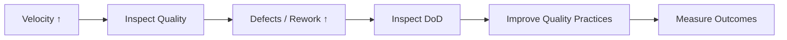

# High Velocity but Declining Quality

**Primary Skill:** Quality + Metrics

> **Portfolio case study:** This is a realistic simulation intended to demonstrate Scrum Master problem-solving. It should not be presented as a claim of specific client/project experience.

## 1. Scenario

Velocity has increased across several Sprints, but production defects, rework, and customer complaints are also increasing.

## 2. Business / Delivery Impact

The organization celebrates higher output while the product becomes less reliable. The team starts optimizing for story count.

## 3. What I Would Observe

- Rising escaped defects
- Increasing rework
- Technical debt
- Stories considered done before full validation
- Velocity treated as a productivity target

## 4. Root Cause Analysis

The team is optimizing a proxy metric instead of the product outcome. The Definition of Done may not be strong enough, and quality work may be invisible in planning.

## 5. Scrum Master's Approach

Inspect the Definition of Done and quality data. Facilitate a conversation about outcomes. Strengthen quality criteria, make technical debt visible, ensure testing and acceptance are part of 'Done', and coach stakeholders that velocity is a planning aid—not an individual or team performance score.

## 6. Metrics to Inspect

- Escaped defects
- Rework rate
- Defect severity
- Technical debt items
- Sprint Goal achievement
- Velocity trend

## 7. Improvement Experiment

The team would agree on a small, measurable experiment rather than introducing a large process change all at once.

```text
Problem → Hypothesis → Experiment → Measure → Inspect → Adapt
```

## 8. Expected Outcome

Quality improves, defects decrease, and stakeholders gain a more realistic view of delivery performance. Velocity may stabilize or even fall initially while true Done work increases.

## 9. Scrum Master Learning

A metric becomes dangerous when it becomes a target. A Scrum Master helps the team inspect a balanced set of signals.

## 10. Interview Answer

“If velocity rises while escaped defects rise, I would treat that as a warning rather than success. I would inspect the Definition of Done and quality signals, then help the team improve quality at the source.”

## 11. Visual



## 12. Portfolio Takeaway

> **The Scrum Master creates the conditions for the team to solve the problem; the Scrum Master does not become the team's problem solver.**
