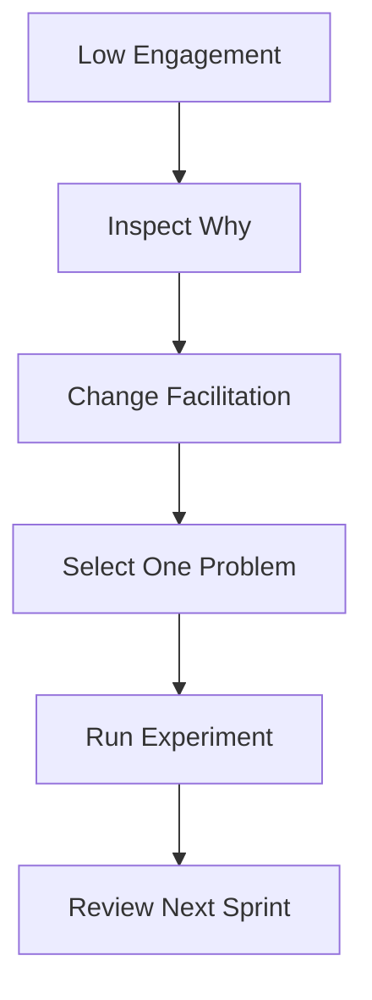

# Team Resistance to Retrospectives

**Primary Skill:** Facilitation + Coaching

> **Portfolio case study:** This is a realistic simulation intended to demonstrate Scrum Master problem-solving. It should not be presented as a claim of specific client/project experience.

## 1. Scenario

A team attends retrospectives but participation is low. Action items repeat and little changes from Sprint to Sprint.

## 2. Business / Delivery Impact

The retrospective becomes a ceremony instead of a learning opportunity, reducing psychological safety and continuous improvement.

## 3. What I Would Observe

- One-word answers
- Repeated complaints
- No experiments
- Action items not followed up
- Same problems every Sprint

## 4. Root Cause Analysis

The format may be stale, trust may be low, or the team may not see evidence that retrospective actions matter. The Scrum Master should inspect the environment rather than blaming the team.

## 5. Scrum Master's Approach

Change the facilitation approach. Use formats such as Start/Stop/Continue, 4Ls, Mad/Sad/Glad, or a Sailboat. Establish a safe environment, focus on one or two systemic issues, create measurable experiments, and review the previous experiment at the next retrospective.

## 6. Metrics to Inspect

- Number of improvement experiments completed
- Recurrence of the same impediment
- Action-item completion
- Team participation

## 7. Improvement Experiment

The team would agree on a small, measurable experiment rather than introducing a large process change all at once.

```text
Problem → Hypothesis → Experiment → Measure → Inspect → Adapt
```

## 8. Expected Outcome

The team shifts from complaint collection to experimentation and learning.

## 9. Scrum Master Learning

A retrospective is successful when it creates meaningful improvement, not merely when everyone speaks.

## 10. Interview Answer

“I would first understand why the retrospective is not working. I would vary the format, create psychological safety, focus on one systemic issue, and follow up on measurable experiments rather than creating a long action list.”

## 11. Visual



## 12. Portfolio Takeaway

> **The Scrum Master creates the conditions for the team to solve the problem; the Scrum Master does not become the team's problem solver.**
