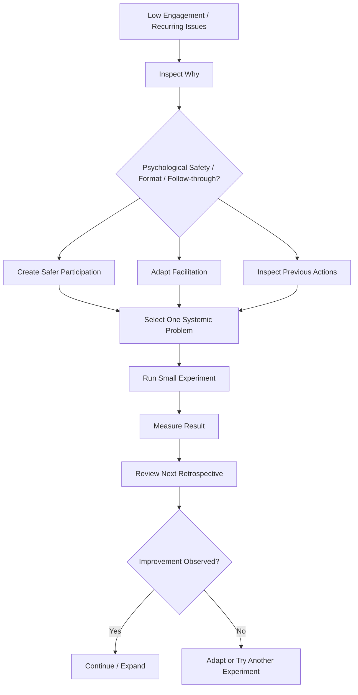

# Team Resistance to Retrospectives

**Primary Skill:** Facilitation + Coaching

> **Portfolio case study:** This is a realistic simulation intended to demonstrate Scrum Master problem-solving. It should not be presented as a claim of specific client/project experience.

## 1. Scenario

A Scrum Team attends Sprint Retrospectives, but participation is consistently low. The same concerns and action items appear Sprint after Sprint, with little visible follow-through or improvement.

Some team members provide only brief answers, while others rarely contribute. Over time, the retrospective starts to feel like a routine ceremony rather than a valuable opportunity for the team to inspect and adapt.

## 2. Business / Delivery Impact

When retrospectives do not lead to meaningful improvement:

- Recurring impediments remain unresolved.
- The team may become disengaged from continuous improvement.
- Problems can become normalized instead of addressed.
- Psychological safety may be affected if people do not feel comfortable speaking openly.
- The team may lose confidence in the value of retrospectives.

The risk is not simply low participation. The bigger concern is that the **inspect-and-adapt cycle is becoming ineffective**.

## 3. What I Would Observe

I would look beyond participation levels and inspect the overall retrospective environment.

Possible signals include:

- One-word or very short answers
- The same complaints appearing repeatedly
- A small number of people dominating the conversation
- Team members remaining silent on sensitive topics
- Action items being created but not revisited
- Too many improvement actions being selected
- No measurable experiments
- Team members questioning whether retrospectives actually lead to change
- The same impediments recurring across multiple Sprints

These are signals to investigate, not proof that the team is simply "resistant."

## 4. Root Cause Analysis

Before changing the retrospective format, I would explore **why participation and follow-through are low**.

Possible areas to investigate include:

- Is there sufficient psychological safety?
- Do team members believe their feedback will lead to action?
- Has the retrospective format become repetitive?
- Are a few voices dominating the discussion?
- Are previous action items being forgotten?
- Is the team selecting too many improvements at once?
- Are some issues outside the team's control?
- Are people uncomfortable discussing certain problems openly?
- Does the team understand the purpose of the retrospective?

The Scrum Master should avoid labeling the team as "unwilling" or "resistant" before understanding the underlying conditions.

## 5. Scrum Master's Approach

I would approach the situation as a **coaching and facilitation challenge**, not as a compliance problem.

### Step 1 — Create psychological safety

Set expectations that the retrospective is a safe space for honest inspection and improvement.

Where appropriate, use techniques such as silent brainstorming or anonymous input to give quieter team members a way to contribute.

### Step 2 — Inspect the current retrospective

Ask the team:

- What is working well about our retrospectives?
- What is not useful?
- What would make these conversations more valuable?
- Are we actually acting on what we identify?

### Step 3 — Vary the facilitation approach

Depending on the team's needs, experiment with formats such as:

- Start / Stop / Continue
- 4Ls — Liked, Learned, Lacked, Longed For
- Mad / Sad / Glad
- Sailboat
- Timeline
- 1-2-4-All

The objective is not to use a different retrospective template every Sprint. The objective is to create conditions for meaningful inspection.

### Step 4 — Focus on one or two systemic issues

Avoid creating a long list of action items.

Help the team identify the improvement that could have the greatest impact and turn it into a small, measurable experiment.

### Step 5 — Follow through

At the next retrospective, inspect the previous experiment:

- What did we try?
- What happened?
- What did we learn?
- Should we continue, adapt, or stop?

This creates a visible connection between **retrospective → experiment → learning → improvement**.

## 6. Metrics / Signals to Inspect

Metrics should be used to support learning, **not to judge individual participation**.

Useful signals include:

- Improvement experiments completed
- Recurrence of the same impediment
- Action-item follow-through
- Number of Sprints with recurring issues
- Participation patterns
- Team feedback on retrospective usefulness

I would avoid treating "number of people who spoke" as a success metric by itself. A quiet team member may still contribute meaningfully through written or anonymous input.

## 7. Improvement Experiment

The team would agree on **one small, measurable experiment** rather than introducing a large process change.

### Example

**Problem:**

The same communication issue has appeared in three consecutive retrospectives.

**Hypothesis:**

If the team introduces a short daily dependency/communication check, then unresolved communication issues will be identified earlier.

**Experiment:**

For the next two Sprints, spend five minutes during the Daily Scrum explicitly identifying cross-team communication risks.

**Measure:**

Track the number of communication-related impediments that remain unresolved at Sprint end.

**Inspect:**

Review the result during the next Retrospective.

**Adapt:**

Continue, modify, or stop the experiment based on what the team learns.

```text
Problem → Hypothesis → Experiment → Measure → Inspect → Adapt
```

## 8. Expected Outcome

The goal is not simply to make every team member speak more.

The desired outcome is a team that:

- Feels safer discussing problems
- Takes greater ownership of improvement
- Experiments with practical changes
- Follows through on agreed improvements
- Reduces recurring impediments
- Sees the retrospective as a useful mechanism for learning

Over time, the retrospective should become a **team-owned improvement conversation**, rather than a meeting facilitated entirely by the Scrum Master.

## 9. Scrum Master Learning

A successful retrospective is not measured by how many people speak or how many action items are created.

It is measured by whether the team is able to **inspect its way of working, learn from what happened, and adapt**.

A Scrum Master should therefore avoid forcing participation and instead create the conditions that make meaningful participation easier.

## 10. Interview Answer

> "I would first understand why participation and follow-through are low instead of labeling the team as resistant. I would inspect psychological safety, the effectiveness of the current retrospective, and whether previous actions are actually producing change. I might vary the facilitation approach, use techniques that give quieter members a voice, and help the team select one small measurable experiment. At the next retrospective, I would inspect the result and adapt based on what the team learned."

## 11. Visual



## 12. Portfolio Takeaway

> **The Scrum Master creates the conditions for the team to solve the problem; the Scrum Master does not become the team's problem solver.**

The goal is not to force the team to participate in retrospectives.

The goal is to help the team develop the **safety, ownership, and learning habits** needed to improve its own way of working.