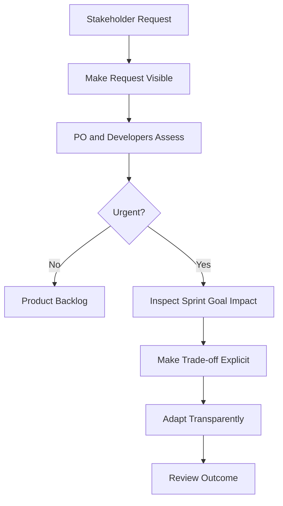

# Stakeholder Assigns Work Directly to Developers

**Primary Skill:** Servant Leadership + Stakeholder Coaching

> **Portfolio case study:** This is a realistic simulation intended to demonstrate Scrum Master problem-solving. It should not be presented as a claim of specific client/project experience.

## 1. Scenario

A senior Engineering Manager approaches Developers directly during the Sprint:

> "Please take this task first. It's urgent."

A Developer accepts the request without informing the Product Owner or the rest of the Scrum Team.

The request may be genuinely important, but the way the work enters the Sprint creates a transparency and prioritization problem.

## 2. Business / Delivery Impact

Direct assignment of work can create several consequences:

* Sprint Goal is affected
* Product Owner loses visibility
* Developers receive conflicting priorities
* Unplanned work enters the Sprint
* The team becomes task-driven instead of Sprint Goal-focused
* Context switching increases
* Trade-offs remain invisible

The issue is therefore not simply **"a manager gave a Developer a task."**

The deeper issue is that the team does not have a transparent mechanism for handling urgent requests and making prioritization trade-offs.

## 3. What I Would Observe

Before intervening, I would inspect the situation.

I would look for:

* How frequently direct assignments happen
* Whether the requests are genuinely urgent
* Why the Engineering Manager approaches Developers directly
* Whether the Product Owner is aware of the requests
* Whether Developers feel pressured to accept the work
* How the request affects the Sprint Goal
* Whether the team has an established urgent-work intake mechanism
* Whether similar interruptions have happened in previous Sprints

This helps avoid treating the stakeholder as the problem without understanding the system around the behavior.

## 4. Root Cause Analysis

The Engineering Manager may be acting directly because:

* The request is genuinely time-sensitive
* The manager believes going directly to Developers is faster
* There is no clear mechanism for urgent work
* The Product Owner and Engineering Manager are not aligned on priorities
* The impact of interrupting Sprint work is not visible
* Developers have developed a habit of accepting requests immediately

The root cause is therefore likely a **lack of transparency and an unclear prioritization mechanism**, rather than simply stakeholder interference.

## 5. Scrum Master's Approach

The Scrum Master should avoid confronting the Engineering Manager aggressively or becoming a gatekeeper between stakeholders and Developers.

Instead, I would use a coaching-based approach.

### Step 1 — Understand the urgency

First, understand why the task is considered urgent.

Is it a production issue? A regulatory requirement? A customer-impacting problem? Or simply a newly preferred task?

### Step 2 — Make the impact visible

Help the team and stakeholder understand what taking the new work means for the current Sprint Goal.

### Step 3 — Involve the right people

Bring the Product Owner and Developers into the prioritization conversation.

The goal is not to prevent urgent work.

The goal is to make the **trade-off explicit**.

### Step 4 — Establish a transparent intake mechanism

Agree on a simple approach for handling urgent requests so that requests are visible rather than being privately assigned to individual Developers.

### Step 5 — Coach the Developer

Developers should feel empowered to respond constructively rather than simply accepting every direct request.

For example:

> "I understand this is important. Let me make the request visible to the team and Product Owner so we can assess its impact on our current Sprint Goal."

### Step 6 — Inspect and adapt

After the experiment, inspect whether direct interruptions decreased and whether urgent work is now handled with better transparency.

## 6. Metrics to Inspect

I would use metrics as **signals for inspection**, not as individual performance measures.

Possible signals include:

* Number of direct work assignments
* Percentage of unplanned work
* Number of Sprint Goal disruptions
* Sprint Goal achievement
* Number of context switches caused by urgent requests
* Frequency of stakeholder interruptions
* Time taken to make urgent-work decisions

The purpose is to understand whether the team's ability to focus and deliver valuable outcomes is improving.

## 7. Improvement Experiment

The team would agree on a small, measurable experiment rather than introducing a large process change.

### Problem

Urgent stakeholder requests are being assigned directly to Developers without the impact on current Sprint work being visible.

### Hypothesis

If urgent requests are made visible and their impact is discussed with the Product Owner and Developers before work begins, then the team will experience fewer hidden interruptions and clearer prioritization.

### Experiment

For the next two Sprints, route urgent requests through a transparent intake mechanism and assess their impact on the Sprint Goal before Developers begin the work.

### Measure

Track:

* Direct assignments
* Unplanned work
* Sprint Goal disruptions

### Inspect

Review the results during the Sprint Retrospective.

### Adapt

Continue, modify, or replace the experiment based on what the team learns.

> **Problem → Hypothesis → Experiment → Measure → Inspect → Adapt**

## 8. Expected Outcome

The goal is **not** to prevent stakeholders from raising urgent business needs.

The expected outcome is:

* Urgent requests remain visible
* Product priorities remain transparent
* Developers are not pulled into conflicting commitments
* Trade-offs become explicit
* Product Owner and Engineering Manager alignment improves
* The team can respond to genuine urgency without silently abandoning Sprint commitments
* The Sprint Goal remains the focus of the team's work

## 9. Scrum Master Learning

Servant leadership does not mean saying **"no"** to stakeholders.

It means helping create an environment where priorities, constraints, and trade-offs are transparent.

The Scrum Master should not become the person who personally controls access to Developers.

Instead, the Scrum Master should help the **Product Owner, Developers, and stakeholders develop a healthier way of handling competing demands.**

> **A Scrum Master protects transparency and focus—not the team from every stakeholder.**

## 10. Interview Answer

> "I would not confront the Engineering Manager aggressively. First, I would understand why the request is urgent and make its impact on the current Sprint Goal visible. I would involve the Product Owner and Developers so the team can make the trade-off transparently. I would also coach the Developer to avoid privately accepting work and establish a clear mechanism for handling urgent requests. My goal would not be to block stakeholders, but to create transparency so the right people can make an informed prioritization decision."

## 11. Visual

## 12. Portfolio Takeaway

> **The Scrum Master creates the conditions for the team to solve the problem; the Scrum Master does not become the team's problem solver.**

The Scrum Master's role is not to become a gatekeeper between stakeholders and Developers.

The goal is to create **transparency, healthy collaboration, clear accountability, and informed trade-offs** so the Scrum Team can respond to business needs without losing focus on valuable outcomes.

This case demonstrates how a Scrum Master can use **servant leadership and stakeholder coaching to improve the system rather than simply controlling people's behavior.**
