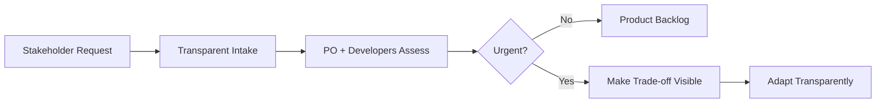

# Stakeholder Assigns Work Directly to Developers

**Primary Skill:** Servant Leadership

> **Portfolio case study:** This is a realistic simulation intended to demonstrate Scrum Master problem-solving. It should not be presented as a claim of specific client/project experience.

## 1. Scenario

A senior stakeholder frequently assigns urgent tasks directly to Developers during the Sprint.

## 2. Business / Delivery Impact

Work becomes less transparent, the Product Owner loses visibility, and the team receives competing priorities.

## 3. What I Would Observe

- Direct requests
- Unplanned work
- Sprint Goal disruption
- Developers unsure which priority to follow

## 4. Root Cause Analysis

The issue is not the stakeholder's intent; it is an unclear work-intake and prioritization mechanism.

## 5. Scrum Master's Approach

Coach the stakeholder on the impact of direct assignments. Create a transparent intake path. When urgent work appears, facilitate an explicit trade-off with the Product Owner and Developers. Make Sprint Goal impact visible instead of blocking stakeholder access.

## 6. Metrics to Inspect

- Unplanned work percentage
- Number of direct assignments
- Sprint Goal achievement
- Stakeholder response time

## 7. Improvement Experiment

The team would agree on a small, measurable experiment rather than introducing a large process change all at once.

```text
Problem → Hypothesis → Experiment → Measure → Inspect → Adapt
```

## 8. Expected Outcome

Urgent requests remain visible and can be handled, but trade-offs become explicit and the team has one coherent priority conversation.

## 9. Scrum Master Learning

Servant leadership is not saying 'no' to stakeholders. It is making priorities and trade-offs transparent.

## 10. Interview Answer

“I would avoid confrontation. I would understand the business urgency, make the impact on the Sprint Goal visible, and establish a transparent path for urgent requests so the right people can make the trade-off.”

## 11. Visual



## 12. Portfolio Takeaway

> **The Scrum Master creates the conditions for the team to solve the problem; the Scrum Master does not become the team's problem solver.**
