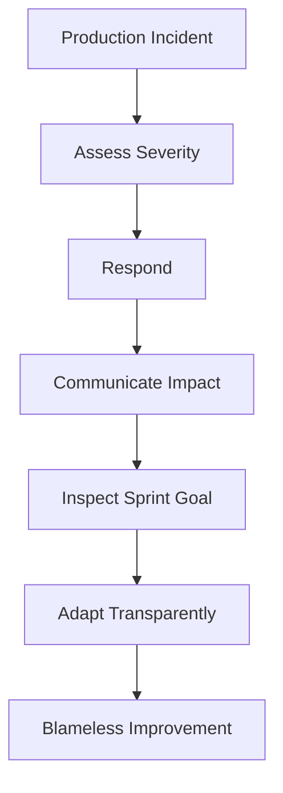

# Production Emergency During a Sprint

**Primary Skill:** Adaptation + Risk Management

> **Portfolio case study:** This is a realistic simulation intended to demonstrate Scrum Master problem-solving. It should not be presented as a claim of specific client/project experience.

## 1. Scenario

A critical production incident occurs halfway through the Sprint and requires immediate engineering attention.

## 2. Business / Delivery Impact

Planned work may be delayed, customer impact is high, and the team is under pressure to react quickly.

## 3. What I Would Observe

- Incident severity
- Customer impact
- Available support capacity
- Sprint Goal impact
- Other commitments at risk

## 4. Root Cause Analysis

First determine whether the incident is genuinely urgent. Then inspect how the response affects the Sprint Goal and make the decision transparent.

## 5. Scrum Master's Approach

Support rapid incident response without hiding the work. Facilitate communication among Product Owner and Developers, make the trade-off explicit, update the Sprint Backlog as needed, and inspect whether the Sprint Goal remains meaningful. Afterward, facilitate a blameless review and improve the system.

## 6. Metrics to Inspect

- Incident response time
- Unplanned work
- Sprint Goal impact
- Mean time to restore
- Repeat incident rate

## 7. Improvement Experiment

The team would agree on a small, measurable experiment rather than introducing a large process change all at once.

```text
Problem → Hypothesis → Experiment → Measure → Inspect → Adapt
```

## 8. Expected Outcome

The production issue is handled quickly while delivery trade-offs remain visible. Follow-up improvements reduce the likelihood of recurrence.

## 9. Scrum Master Learning

Scrum is not rigidity. Adaptation is expected when new information changes what is most valuable.

## 10. Interview Answer

“For a true production emergency, I would prioritize customer impact and rapid response while maintaining transparency. After the incident, I would inspect its impact on the Sprint Goal and facilitate a blameless improvement discussion.”

## 11. Visual



## 12. Portfolio Takeaway

> **The Scrum Master creates the conditions for the team to solve the problem; the Scrum Master does not become the team's problem solver.**
