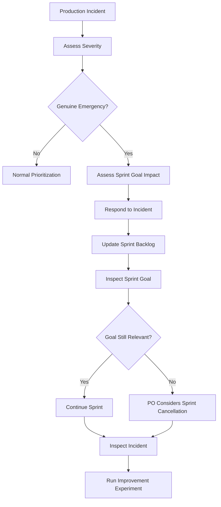

# Production Emergency During Sprint

**Primary Skill:** Incident Response + Servant Leadership + Stakeholder Management

> **Portfolio case study:** This is a realistic simulation intended to demonstrate Scrum Master problem-solving. It should not be presented as a claim of specific client/project experience.

## 1. Scenario

A critical production issue occurs halfway through the Sprint.

The issue is affecting users or business operations and requires immediate attention from the Scrum Team.

The team must respond quickly while understanding the impact on the current Sprint Goal.

The key question is:

Is this genuinely an emergency, and what is the impact on the Sprint Goal?

## 2. Business / Delivery Impact

A production emergency can result in:

Planned Sprint work being interrupted
Sprint Goal being put at risk
Developers switching context
Other planned work being delayed
Stakeholders requesting immediate action
Increased pressure on the Scrum Team
Reduced predictability if emergency work is not made visible

The Scrum Master should help the team respond to the incident without creating unnecessary process rigidity or hidden work.

## 3. What I Would Observe

Before deciding how to respond, I would inspect:

Severity of the production issue
Customer and business impact
Whether immediate action is genuinely required
Current Sprint Goal
Current Sprint Backlog
Available Developers and relevant skills
Expected effort to resolve the issue
Impact on planned Sprint work
Whether similar production emergencies have occurred before

The purpose is to make the situation visible and support an informed decision.

## 4. Root Cause Analysis

The immediate production issue may require urgent action, but the Scrum Master should also help the team understand the broader pattern.

Possible contributing factors could include:

Defect escaping into production
Insufficient automated or regression testing
Incomplete monitoring or alerting
Technical debt
Deployment or configuration issues
Missing operational safeguards
Recurring production incidents
Gaps in the Definition of Done or quality practices

The Scrum Master should avoid turning the incident into a blame exercise.

The immediate priority is restoring service and protecting users.

The longer-term opportunity is to understand how the team can reduce the likelihood of recurrence.

## 5. Scrum Master's Approach

The Scrum Master should not blindly say:

"No changes are allowed during a Sprint."

Instead, I would facilitate a transparent response.

Step 1 — Assess the emergency

Understand the severity, impact, and urgency of the production issue.

Step 2 — Make the situation visible

Ensure the Product Owner and Developers understand the incident and its potential impact on the Sprint Goal.

Step 3 — Assess Sprint Goal impact

The team should determine what the emergency means for the current Sprint commitment.

Step 4 — Respond to the incident

If immediate action is required, the Developers should focus on resolving the production issue.

Step 5 — Update the Sprint Backlog transparently

The Sprint Backlog is adapted based on what the team learns.

Planned work may need to be reordered, adjusted, or removed as appropriate.

Step 6 — Maintain focus on the Sprint Goal

The team should continuously inspect whether the Sprint Goal remains achievable.

If the Sprint Goal becomes obsolete, the Product Owner has the authority to cancel the Sprint.

Step 7 — Inspect and learn

After the incident is stabilized, the team should inspect what happened and identify opportunities to improve quality and prevent recurrence.

## 6. Metrics to Inspect

Metrics should be used as signals for learning rather than individual performance measures.

Possible signals include:

Number of production incidents
Incident frequency
Mean time to restore service
Production defect trend
Emergency/unplanned work percentage
Sprint Goal achievement
Recurrence of similar incidents
Time spent on emergency work

The goal is not simply to reduce a metric.

The goal is to understand whether the team's ability to deliver valuable and reliable outcomes is improving.

## 7. Improvement Experiment

The team would select one improvement based on what was learned from the incident.

Problem

A production issue required significant unplanned effort during the Sprint.

Hypothesis

If the team strengthens the specific quality or prevention practice that contributed to the incident, then similar production issues will be detected earlier or prevented in future Sprints.

Experiment

For the next two Sprints, introduce one targeted improvement—for example, an additional automated regression check for the affected functionality.

Measure

Track:

Similar production defects
Defects detected before production
Emergency work related to the affected area
Inspect

Review the results during the Sprint Retrospective.

Adapt

Continue, modify, or replace the experiment based on what the team learns.

Problem → Hypothesis → Experiment → Measure → Inspect → Adapt

## 8. Expected Outcome

The goal is not to pretend that production emergencies can always be avoided.

The expected outcome is:

The emergency is handled quickly
Business and customer impact is minimized
Sprint impact is transparent
The Sprint Backlog reflects the team's current understanding
The Product Owner and Developers understand the trade-offs
The team continues to focus on the Sprint Goal
Learning from the incident leads to improvement
## 9. Scrum Master Learning

Scrum is not about protecting a Sprint from every change.

It provides a framework in which the Scrum Team can inspect and adapt as circumstances change.

A Scrum Master should help the team respond to genuine emergencies while maintaining transparency and focus on valuable outcomes.

The Scrum Master's role is not to make the technical decision or decide which work Developers must perform.

Instead, the Scrum Master facilitates transparency, removes impediments, and helps the team inspect and adapt.

## 10. Interview Answer

"If a critical production issue occurred during the Sprint, I would first understand its severity and confirm whether it genuinely requires immediate action. I would make the incident and its impact visible to the Product Owner and Developers, then facilitate a discussion about the Sprint Goal and necessary trade-offs. If the emergency requires immediate attention, the team should respond rather than follow a rigid rule that nothing can change during a Sprint. The Sprint Backlog can be adapted based on what we learn, while the Sprint Goal remains the focus. After the incident, I would encourage the team to inspect the root causes and identify a measurable improvement experiment to reduce recurrence."

## 11. Visual

## 12. Portfolio Takeaway

Scrum is not rigidity. Scrum provides a framework for responding to change while maintaining focus on valuable outcomes.

A production emergency should not automatically become an excuse to abandon the Sprint Goal or bypass transparency.

The Scrum Master's role is to help the team respond, make trade-offs visible, inspect the impact, and learn from the incident.

The goal is not to prevent every change.

The goal is to help the Scrum Team adapt intelligently while continuing to deliver value.
