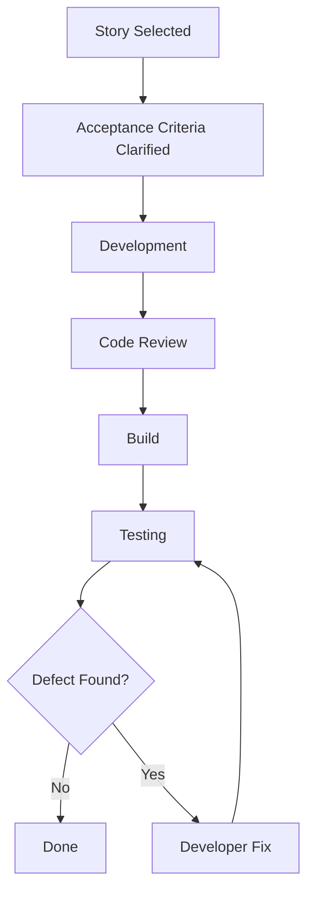

# Case Study 7 — Conflict Between Developer and QA Engineer

> **Portfolio Simulation**  
> Scenario-based case study designed to demonstrate Scrum Master problem-solving. Not a claim of specific client, employer, or production experience. Metrics and outcomes are illustrative.

---

## 1. Scenario

A conflict starts developing between a Developer and QA Engineer during the Sprint.

The Developer says:

> "The tester is blocking my story."

The QA Engineer responds:

> "The developer gives me builds too late."

The disagreement gradually becomes a **Developer vs QA** situation, with both sides blaming each other for delays.

As Scrum Master, instead of taking sides, I would investigate the **workflow and system around the conflict**.

---

## 2. Business / Delivery Impact

The conflict begins affecting delivery:

- Testing starts late in the Sprint
- Defects are discovered close to the Sprint boundary
- Developers have less time for defect resolution
- QA has less time for proper validation and retesting
- Stories remain unfinished
- Team members become frustrated
- The Sprint Goal may be at risk

The visible problem is interpersonal conflict, but the underlying delivery problem may be **how work flows through the team**.

---

## 3. What I Would Observe

I would map the actual workflow:

Development

↓

Code Review

↓

Build

↓

Testing

↓

Defect Fix

↓

Retesting

↓

Done

I would then inspect questions such as:

- When does development actually finish?
- When does QA receive a build?
- How long does code review take?
- When are acceptance criteria clarified?
- When does testing begin?
- How many stories reach QA simultaneously?
- How much time is available for defect fixing and retesting?

The investigation reveals that **testing is starting mainly during the last two days of the Sprint**.

---

## 4. Root Cause Analysis

The initial perception is:

**Developer vs QA conflict**

But the deeper problem is:

**A workflow and collaboration problem.**

The team has allowed work to accumulate before testing begins.

This creates a chain reaction:

**Late Development → Late Testing → Late Defects → Late Fixes → Late Retesting → Incomplete Stories**

The conflict is therefore a **symptom of the workflow problem**, rather than simply a personality conflict.

---

## 5. Scrum Master's Approach

I would facilitate a conversation focused on the **process rather than personalities**.

Instead of asking:

> "Who caused the delay?"

I would ask:

> "Where is work getting delayed, and what can we change in the way we collaborate?"

### Improvement Actions

**1. Smaller Stories**

Break large stories into smaller valuable increments where possible.

**2. Earlier Collaboration**

Developers and QA collaborate before implementation is completed.

**3. Three Amigos Discussions**

Bring Product Owner, Developer, and QA perspectives together to clarify the story and acceptance criteria.

**4. Continuous Testing**

Avoid treating testing as an activity that begins only at the end of the Sprint.

**5. Developer–QA Pairing**

Encourage closer collaboration when a story is complex or high-risk.

**6. Earlier Acceptance-Criteria Clarification**

Identify ambiguity before development progresses too far.

---

## 6. Metrics to Inspect

Rather than measuring only individual performance, I would inspect the **flow of work**.

| Metric | What it helps reveal |
|---|---|
| Cycle time | How long work takes from start to Done |
| Time spent waiting for testing | Testing bottlenecks |
| Defects found late | Effectiveness of earlier collaboration |
| Rework | Quality and requirement clarity issues |
| Stories completed early enough for testing | Flow through the Sprint |
| Defect turnaround time | Speed of feedback and resolution |

The purpose is **not to compare Developer vs QA performance**.

The purpose is to understand where the system is slowing down.

---
## 7. Improvement Experiment

### Experiment: Shift Testing Earlier

For the next Sprint:

- Discuss acceptance criteria before development begins
- Use Three Amigos discussions for selected stories
- Break large stories into smaller slices
- Involve QA earlier during development
- Encourage Developer–QA collaboration
- Avoid allowing most stories to reach QA near Sprint-end
- Inspect the workflow during the Daily Scrum

### Inspect

At the end of the Sprint, review:

- When testing actually started
- How many stories reached QA late
- Defects discovered earlier vs later
- Rework
- Cycle time
- Stories completed within the Sprint

### Adapt

Use the findings to adjust the team's working approach in the next Sprint.

---

## 8. Expected Outcome

The expected improvement is not simply:

> "Developers and QA stop arguing."

The desired outcome is a healthier delivery system where:

- Testing starts earlier
- Feedback reaches Developers sooner
- Defects are discovered earlier
- Rework is reduced
- Developers and QA collaborate more closely
- Stories flow toward Done more consistently

---

## 9. Scrum Master Learning

### Key Learning

> **A Scrum Master should solve systemic problems rather than choosing sides in team conflicts.**

When two team members blame each other, the Scrum Master should look beyond the immediate disagreement.

Ask:

**What is the system making difficult?**

The objective is to help the Developers become better at managing their own work and improving their collaboration.

---

## 10. Interview Answer

**Interviewer:**  
"How would you handle a conflict between a Developer and QA Engineer?"

**Answer:**

> "I would avoid immediately taking sides. First, I would understand both perspectives and map the workflow to identify where the delay is occurring. If I discovered that testing was consistently starting only during the last two days of the Sprint, I would treat that as a workflow problem rather than simply a Developer-versus-QA conflict.
>
> I would facilitate collaboration between the team members and introduce improvements such as smaller stories, earlier acceptance-criteria clarification, Three Amigos discussions, earlier QA involvement, and closer Developer–QA collaboration.
>
> I would then inspect metrics such as cycle time, late testing, defect turnaround time, and rework to see whether the experiment improved the flow.
>
> My focus would be on improving the system and enabling the team to solve the problem themselves rather than deciding who was at fault."

---

## 11. Visual

### Key Idea

**Earlier collaboration + shorter feedback loops → smoother flow toward Done**

---

## 12. Portfolio Takeaway

### What This Case Demonstrates

**Primary Skills**

* Conflict Resolution
* Facilitation
* Systems Thinking
* Quality Collaboration

**Supporting Skills**

* Workflow Analysis
* Continuous Improvement
* Metrics
* Cross-functional Collaboration
* Coaching

### Scrum Master Mindset

> **Don't ask "Who is blocking whom?"**
>
> **Ask "What is blocking the flow of value?"**

This case demonstrates how a Scrum Master can use a quality-focused perspective to improve team collaboration without taking ownership of the QA or Development function.

---
