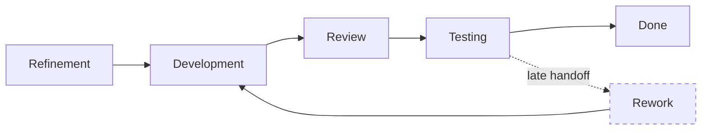

# Developer–QA Conflict

**Primary Skill:** Conflict Resolution + Quality

> **Portfolio case study:** This is a realistic simulation intended to demonstrate Scrum Master problem-solving. It should not be presented as a claim of specific client/project experience.

## 1. Scenario

A Developer says QA is blocking delivery. QA says builds arrive too late for meaningful testing. Both sides begin blaming each other.

## 2. Business / Delivery Impact

Collaboration deteriorates, testing is pushed toward the end of the Sprint, and defects are discovered late.

## 3. What I Would Observe

- Testing starts late
- Handoffs between roles
- Defects found near Sprint end
- Waiting time
- Unclear acceptance criteria

## 4. Root Cause Analysis

The visible conflict is a symptom of a workflow problem. The Scrum Master maps the end-to-end flow rather than choosing a side.

## 5. Scrum Master's Approach

Map the workflow from refinement to Done. Facilitate a blameless conversation. Improve acceptance criteria, encourage earlier QA involvement, use three-amigos discussions where useful, split stories into smaller vertical slices, and encourage developers and QA to collaborate continuously.

## 6. Metrics to Inspect

- Cycle time
- Waiting time
- Defect discovery stage
- Rework
- Stories completed with testing earlier in Sprint

## 7. Improvement Experiment

The team would agree on a small, measurable experiment rather than introducing a large process change all at once.

```text
Problem → Hypothesis → Experiment → Measure → Inspect → Adapt
```

## 8. Expected Outcome

Testing starts earlier, defects are found sooner, handoffs decrease, and the team becomes more collaborative.

## 9. Scrum Master Learning

Scrum Masters should solve systemic workflow problems instead of choosing sides in interpersonal conflicts.

## 10. Interview Answer

“I would avoid deciding whether Development or QA is at fault. I would visualize the workflow, identify where work waits, and help the team improve collaboration so quality is built throughout the Sprint.”

## 11. Visual



## 12. Portfolio Takeaway

> **The Scrum Master creates the conditions for the team to solve the problem; the Scrum Master does not become the team's problem solver.**
