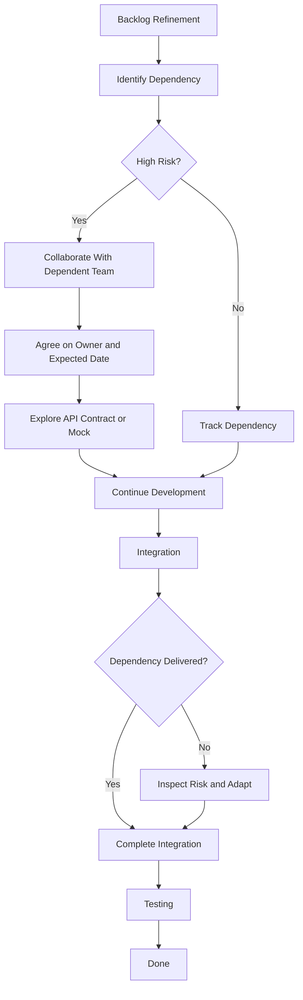

# Case Study 8 — Dependencies Are Constantly Blocking the Team

> **Portfolio Simulation**  
> Scenario-based case study designed to demonstrate Scrum Master problem-solving. Not a claim of specific client, employer, or production experience. Metrics and outcomes are illustrative.

---

## 1. Scenario

The Scrum Team frequently encounters dependencies on other teams.

During the Sprint, the team repeatedly says:

> "We can't complete this story because another team hasn't delivered their API."

The dependency is discovered only after the Sprint has already started.

As a result:

- Developers wait for external deliverables
- Testing is delayed
- Stories remain partially completed
- Sprint Goals become harder to achieve
- Team members become frustrated

The Scrum Master recognizes that the problem is not simply that **dependencies exist**.

The bigger problem is that dependencies are being **identified and managed too late**.

---

## 2. Business / Delivery Impact

Unmanaged dependencies can create:

- Blocked work
- Waiting time
- Increased cycle time
- Delayed integration
- Late testing
- Increased delivery risk
- Unpredictable Sprint outcomes

A team may appear to be progressing well internally while being blocked by work outside the team.

The Scrum Master therefore needs to make dependencies **visible early enough for the team to respond**.

---

## 3. What I Would Observe

I would first understand the dependency flow across teams.

For example:

```text
Team A
   │
   ├── API
   ↓
Team B
   │
   ├── Integration
   ↓
Team C
   │
   └── Testing
```

I would inspect:

- Which dependencies occur repeatedly?
- When are they identified?
- Who owns the dependency?
- What is the expected delivery date?
- What happens when the dependency is delayed?
- Are dependencies discussed during refinement?
- Are teams communicating directly?
- Can the work be developed independently using mocks or agreed contracts?
- Is the dependency genuinely required to achieve the Sprint Goal?

---
## 4. Root Cause Analysis

The initial problem appears to be:

**"Another team is blocking us."**

But the deeper issue may be:

**Dependencies are being discovered too late and are not being actively managed.**

A typical pattern may look like:

**Dependency exists → Sprint starts → Team begins development → Dependency discovered → Team waits → Testing delayed → Sprint risk increases**

The Scrum Master should therefore shift the team's mindset from:

> "We will deal with dependencies when they block us."

to:

> **"We will identify and make important dependencies visible as early as possible."**

---

## 5. Scrum Master's Approach

### Step 1 — Make Dependencies Visible

Create a simple dependency map and track:

| Dependency | Owner | Expected Date | Risk | Status | Impact |
|---|---|---|---|---|---|
| API from Team A | Team A | Sprint Day 4 | High | In Progress | Integration |
| Test data from Team C | Team C | Sprint Day 5 | Medium | Pending | Testing |
| Interface specification | Team B | Sprint Day 2 | Low | Confirmed | Development |

The purpose is not to create administrative overhead.

The purpose is to create **transparency around work that could affect delivery**.

### Step 2 — Identify Dependencies Earlier

Encourage the team to discuss dependencies during:

- Backlog refinement
- Story discussions
- Three Amigos discussions
- Cross-team refinement sessions
- Sprint Planning

### Step 3 — Encourage Direct Collaboration

Instead of the Scrum Master becoming the permanent coordinator between teams, encourage the relevant Developers and teams to collaborate directly.

### Step 4 — Explore Technical Alternatives

Where appropriate, the teams can consider:

- API contracts
- Mock services
- Test stubs
- Simulated responses
- Smaller vertical slices

These approaches can reduce unnecessary waiting and allow teams to continue making progress while external work is being completed.

---
## 6. Metrics to Inspect

I would inspect metrics that help the team understand the impact of dependencies.

| Metric | What it helps reveal |
|---|---|
| Number of blocked items | Dependency-related interruptions |
| Blocked time | How long work waits |
| Dependency lead time | Time from request to delivery |
| Stories delayed by dependencies | Delivery impact |
| Repeated dependencies | Systemic dependency patterns |
| Cycle time | Effect of waiting on overall flow |

The goal is not to blame the dependent team.

The goal is to identify **patterns that the teams can improve together**.

---

## 7. Improvement Experiment

### Experiment: Dependency Discovery Before Sprint Planning

For the next few Sprints:

1. Identify significant dependencies during refinement.
2. Record the dependency owner and expected date.
3. Discuss high-risk dependencies with the relevant team early.
4. Confirm API or interface expectations before development begins.
5. Explore mocks or stubs where appropriate.
6. Use smaller vertical slices where possible.
7. Review unresolved dependencies during Sprint events.

### Inspect

At the end of the Sprint, review:

- How many dependencies were identified before Sprint Planning?
- How many were discovered after the Sprint started?
- How much work was blocked?
- Which dependencies repeatedly caused delays?
- Did earlier collaboration reduce waiting time?

### Adapt

Use the findings to improve the team's refinement and cross-team collaboration approach.

---

## 8. Expected Outcome

The desired outcome is not:

> "Eliminate all dependencies."

Dependencies are often a natural part of complex product development.

The desired outcome is:

- Dependencies become visible earlier
- Ownership becomes clearer
- Teams communicate sooner
- Risks are identified before they become blockers
- Integration happens earlier
- Waiting time is reduced
- Sprint Planning becomes more informed
- The team has more predictable flow toward the Sprint Goal

---
## 9. Scrum Master Learning

### Key Learning

> **A Scrum Master does not eliminate every dependency. The Scrum Master helps make dependencies transparent and enables the team and organization to address them effectively.**

A dependency should not automatically become a reason for another team to be blamed.

Instead, the Scrum Master should help the teams ask:

- Can we identify this dependency earlier?
- Can the teams collaborate directly?
- Can we reduce the dependency?
- Can we change the way work is sliced?
- Can we use a technical alternative to reduce waiting?

The focus is on **improving the system rather than assigning blame**.

---

## 10. Interview Answer

**Interviewer:**  
"How would you handle a Scrum Team that is constantly blocked by dependencies on other teams?"

**Answer:**

> "First, I would make the dependencies visible and understand their impact on the team's Sprint Goal. I would map the dependency, owner, expected date, risk, status, and impact rather than waiting until the Sprint is already blocked.
>
> I would then encourage the team to identify significant dependencies during refinement and collaborate directly with the dependent teams. Where technically appropriate, I would explore options such as API contracts, mock services, or smaller vertical slices to reduce waiting.
>
> I would also inspect metrics such as blocked time, dependency lead time, and the number of stories delayed by dependencies.
>
> My goal would not be to eliminate every dependency, because some dependencies are inherent in complex products. My goal would be to make them visible earlier, reduce avoidable waiting, and help the teams improve the overall flow of value."

---

## 11. Visual



### Key Idea

**Early visibility + cross-team collaboration + smaller slices → reduced dependency-related waiting**

---

## 12. Portfolio Takeaway

### What This Case Demonstrates

**Primary Skills**
- Dependency Management
- Systems Thinking
- Cross-Team Collaboration
- Risk Management

**Supporting Skills**
- Facilitation
- Backlog Refinement
- Metrics
- Impediment Removal
- Continuous Improvement
- Stakeholder Collaboration

### Scrum Master Mindset

> **Don't wait for a dependency to become a blocker. Make it visible early enough for the team to act.**

A Scrum Master does not need to personally coordinate every dependency.

The goal is to help the team and organization build better collaboration, transparency, and flow so that dependencies can be addressed before they become Sprint-level surprises.

---
