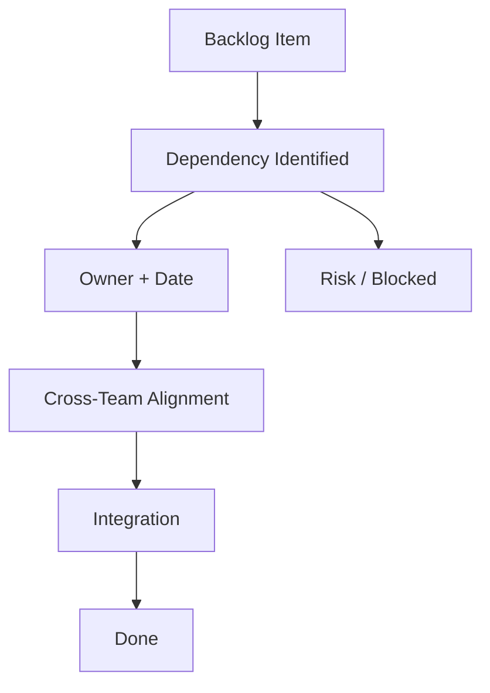

# Cross-Team Dependencies Blocking Delivery

**Primary Skill:** Dependency Management

> **Portfolio case study:** This is a realistic simulation intended to demonstrate Scrum Master problem-solving. It should not be presented as a claim of specific client/project experience.

## 1. Scenario

A team repeatedly discovers that it cannot complete stories because another team has not delivered an API, environment, or required component.

## 2. Business / Delivery Impact

Stories remain blocked, cycle time increases, and Sprint Goals become difficult to achieve.

## 3. What I Would Observe

- Dependencies discovered during Sprint
- External waiting time
- Unclear ownership
- Integration performed too late
- Cross-team priorities misaligned

## 4. Root Cause Analysis

The organization is discovering dependencies too late. The Scrum Master needs to improve visibility and collaboration rather than simply escalating every blocker.

## 5. Scrum Master's Approach

Create a dependency map. Identify owners and expected dates. Encourage early cross-team refinement, API contracts, mocks where appropriate, integrated reviews, and smaller vertical slices. Escalate systemic organizational impediments when the teams cannot resolve them themselves.

## 6. Metrics to Inspect

- Blocked time
- Dependency age
- Cycle time
- Number of late dependency discoveries
- Sprint Goal achievement

## 7. Improvement Experiment

The team would agree on a small, measurable experiment rather than introducing a large process change all at once.

```text
Problem → Hypothesis → Experiment → Measure → Inspect → Adapt
```

## 8. Expected Outcome

Dependencies are identified earlier and fewer stories become blocked unexpectedly.

## 9. Scrum Master Learning

Good dependency management is proactive. Escalation is useful, but collaboration and early visibility should come first.

## 10. Interview Answer

“I would make dependencies visible before the Sprint where possible. I would facilitate cross-team conversations, identify ownership and timing, and use metrics such as blocked time and dependency age to inspect whether the system is improving.”

## 11. Visual



## 12. Portfolio Takeaway

> **The Scrum Master creates the conditions for the team to solve the problem; the Scrum Master does not become the team's problem solver.**
