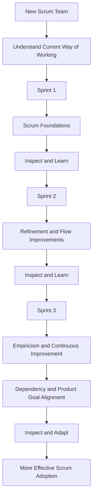

# Case Study 9 — Introducing Scrum to a New Team

> **Portfolio Simulation**  
> Scenario-based case study designed to demonstrate Scrum Master coaching and problem-solving. Not a claim of specific client, employer, or production experience. Metrics and outcomes are illustrative.

---

## 1. Scenario

A newly formed team has never worked with Scrum.

During the initial discussions, team members raise questions such as:

> "Why do we need Daily Scrum?"

> "Why can't the manager assign tasks?"

> "Why do we need retrospectives?"

The questions indicate that the team is unfamiliar with Scrum and may initially view Scrum events and accountabilities as additional process rather than as mechanisms for creating transparency, inspection, and adaptation.

As Scrum Master, I would avoid overwhelming the team with a long theoretical presentation.

Instead, I would use a **learning-by-doing approach** and introduce Scrum concepts progressively through actual Sprint experience.

---

## 2. Business / Delivery Impact

Introducing Scrum without helping the team understand the purpose behind the framework can create several challenges:

- Scrum events may become status meetings
- Team members may wait for managers to assign work
- Sprint Goals may not be understood
- Developers may focus on individual tasks instead of the Sprint Goal
- Retrospectives may become complaint sessions
- Product Backlog items may be too large or unclear
- The team may struggle to inspect and adapt its way of working
- Scrum may be perceived as a collection of meetings rather than an empirical framework

The Scrum Master's responsibility is not simply to teach Scrum terminology.

The goal is to help the team **understand, experience, inspect, and improve** the way they work.

---

## 3. What I Would Observe

Before introducing additional practices, I would observe how the team currently works.

I would look for:

- How the team understands the purpose of a Sprint
- Whether the team understands the Sprint Goal
- How Developers decide what work to take on
- Whether the Product Owner and Developers collaborate effectively
- Whether the Daily Scrum focuses on progress toward the Sprint Goal
- Whether the Definition of Done is understood
- How the team handles unfinished work
- Whether the Sprint Review creates useful feedback
- Whether the Retrospective results in actionable improvements
- Where the team is confused about Scrum accountabilities and events

I would use these observations to determine **what the team needs to learn next**, rather than introducing every Scrum practice at once.

---
## 4. Root Cause Analysis

The initial problem may appear to be:

**"The team does not know Scrum."**

But the deeper issue is often:

**The team has not yet experienced why Scrum practices are useful.**

For example:

- If the Daily Scrum becomes a status meeting, the team may not understand its purpose.
- If managers continue assigning individual tasks, Developers may not experience self-management.
- If the Retrospective produces no meaningful improvement, the team may see it as unnecessary.
- If the Sprint Goal is unclear, the team may focus on completing individual items rather than achieving a valuable outcome.

Therefore, simply providing more Scrum theory may not solve the underlying problem.

The Scrum Master can help the team learn through **practice, observation, and adaptation**.

---

## 5. Scrum Master's Approach

### Principle: Learn by Doing

Instead of starting with a long Scrum theory session, I would introduce the framework progressively through actual Sprint experiences.

### Sprint 1 — Establish the Foundations

Focus on:

- Scrum accountabilities
- Sprint Goal
- Daily Scrum
- Definition of Done
- Sprint Review
- Sprint Retrospective

The objective is to help the team experience the basic Scrum cycle:

**Plan → Develop → Inspect → Adapt**

I would explain the purpose of each practice as the team experiences it.

### Sprint 2 — Improve the Way Work Flows

Once the team has experienced the basic Scrum cycle, introduce:

- Backlog refinement
- Story splitting
- Forecasting
- Flow-oriented metrics

The focus shifts toward helping the team improve how work is prepared, selected, and moved toward Done.

### Sprint 3 — Strengthen Empiricism and Improvement

Introduce deeper concepts such as:

- Empirical process control
- Continuous improvement
- Dependency management
- Product Goal alignment

The focus is now on helping the team connect its Sprint-level work with the broader product direction and continuously improve its way of working.

---

## 6. Metrics to Inspect

I would avoid using metrics as performance scores for individual team members.

Instead, I would use them to understand whether the team's way of working is improving.

| Metric / Signal | What it helps reveal |
|---|---|
| Sprint Goal achievement | Whether the team is focusing on valuable outcomes |
| Cycle time | How efficiently work flows toward Done |
| Work item age | Items that may be waiting or becoming stuck |
| Blocked time | Impact of impediments and dependencies |
| Defects / rework | Quality and effectiveness of the team's process |
| Retrospective actions completed | Whether improvement actions are being followed through |
| Forecast vs actual completion | How the team's forecasting understanding develops |

The metrics would be used as **conversation starters**, not as targets for the team.

---
## 7. Improvement Experiment

### Experiment: Progressive Scrum Adoption

Rather than expecting the team to master Scrum immediately, I would use a gradual improvement approach.

### Sprint 1

Focus on establishing a shared understanding of:

- Sprint Goal
- Scrum accountabilities
- Daily Scrum
- Definition of Done
- Sprint Review
- Sprint Retrospective

At the Retrospective, ask:

> "What part of our Scrum way of working is still unclear or creating difficulty?"

Select one or two improvement areas.

### Sprint 2

Introduce improvements based on Sprint 1 observations.

Focus on:

- Better refinement
- Smaller stories
- Clearer acceptance criteria
- Forecasting
- Flow visibility

Again, inspect the results during the Retrospective.

### Sprint 3

Build on the team's experience by introducing:

- Empirical process control
- Dependency management
- Continuous improvement
- Product Goal alignment

The team should gradually move from **learning Scrum practices** toward **using Scrum to improve product delivery and collaboration**.

---

## 8. Expected Outcome

The desired outcome is not simply:

> "The team knows Scrum terminology."

The desired outcome is a team that increasingly understands **why Scrum practices exist and how to use them effectively**.

Expected improvements include:

- Greater clarity around Scrum accountabilities
- Better understanding of the Sprint Goal
- More effective Daily Scrums
- Greater Developer self-management
- Better-prepared Product Backlog items
- Earlier identification of dependencies
- More meaningful Sprint Reviews
- More actionable Retrospectives
- Improved collaboration
- Stronger connection between Sprint work and the Product Goal

The team should gradually become more capable of **inspecting its own way of working and adapting it**.

---

## 9. Scrum Master Learning

### Key Learning

> **Scrum adoption is a journey, not a one-time training session.**

A Scrum Master should not measure success by how much Scrum theory the team can repeat.

A stronger indicator is whether the team is gradually becoming more capable of:

- Understanding the purpose of Scrum
- Self-managing its work
- Inspecting progress toward the Sprint Goal
- Collaborating effectively
- Identifying impediments
- Learning from feedback
- Adapting its way of working

The Scrum Master acts as a **teacher, coach, facilitator, and change agent**, adapting the approach to the team's context.

---
## 10. Interview Answer

**Interviewer:**  
"How would you introduce Scrum to a team that has never worked with Scrum before?"

**Answer:**

> "I would avoid starting with a long theoretical Scrum training session. I would first understand the team's current way of working and then introduce Scrum through a learning-by-doing approach.
>
> In the first Sprint, I would focus on the foundations: Scrum accountabilities, the Sprint Goal, Daily Scrum, Definition of Done, Sprint Review, and Retrospective. The objective would be to help the team experience the basic inspect-and-adapt cycle.
>
> In the second Sprint, based on what I observed, I would introduce practices such as refinement, story splitting, forecasting, and flow metrics. In the third Sprint, I could help the team deepen its understanding of empiricism, continuous improvement, dependencies, and Product Goal alignment.
>
> Throughout the process, I would use coaching, observation, feedback, and Retrospectives to adapt the approach rather than assuming every team needs the same training.
>
> My goal would be to help the team understand not just what Scrum practices are, but why they are useful and how they can use them to improve their delivery and collaboration."

---

## 11. Visual

### Key Idea

**Learn → Practice → Inspect → Adapt → Improve**

Scrum adoption becomes a continuous learning journey rather than a one-time training event.

---

## 12. Portfolio Takeaway

### What This Case Demonstrates

**Primary Skills**
- Agile Coaching
- Scrum Adoption
- Facilitation
- Servant Leadership

**Supporting Skills**
- Teaching
- Team Development
- Continuous Improvement
- Empirical Process Control
- Flow Awareness
- Product Goal Alignment
- Dependency Management

### Scrum Master Mindset

> **Don't try to teach everything at once. Help the team experience, inspect, and improve Scrum one Sprint at a time.**

A Scrum Master should adapt the coaching approach to the team's needs and maturity rather than treating Scrum adoption as a checklist.

The objective is not simply **Scrum compliance**.

The objective is to help the team become increasingly capable of **self-management, inspection, adaptation, and delivering valuable outcomes**.

---

> **Portfolio Note:** This case study is a realistic simulation created to demonstrate Scrum Master coaching, Scrum adoption, facilitation, and continuous-improvement thinking. It does not represent specific client, employer, or production experience.
