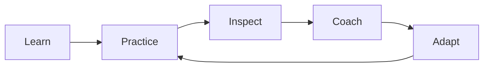

# Launching a New Scrum Team

**Primary Skill:** Coaching + Scrum Adoption

> **Portfolio case study:** This is a realistic simulation intended to demonstrate Scrum Master problem-solving. It should not be presented as a claim of specific client/project experience.

## 1. Scenario

A newly formed team has limited Scrum experience. Team members ask why they need Daily Scrum, Reviews, and Retrospectives, and stakeholders are used to assigning tasks directly.

## 2. Business / Delivery Impact

Without coaching, Scrum can become a set of meetings without understanding the purpose behind them.

## 3. What I Would Observe

- Role confusion
- Task assignment behavior
- Weak Sprint Goals
- Large stories
- Retrospectives without action

## 4. Root Cause Analysis

People need to experience the value of Scrum, not just memorize its rules. The Scrum Master should teach, facilitate, observe, and adapt the coaching approach.

## 5. Scrum Master's Approach

Start with the Scrum purpose and empiricism. Use the first Sprints to establish a small set of healthy behaviors: meaningful Sprint Goals, usable increments, focused Daily Scrums, effective Reviews, and actionable Retrospectives. Gradually deepen practices such as refinement, flow metrics, and dependency management.

## 6. Metrics to Inspect

- Sprint Goal achievement
- Carryover
- Cycle time
- Blocked time
- Improvement experiments
- Stakeholder feedback

## 7. Improvement Experiment

The team would agree on a small, measurable experiment rather than introducing a large process change all at once.

```text
Problem → Hypothesis → Experiment → Measure → Inspect → Adapt
```

## 8. Expected Outcome

The team gradually becomes more self-managing and understands the purpose behind Scrum events instead of treating them as mandatory meetings.

## 9. Scrum Master Learning

Scrum adoption is a journey. The Scrum Master coaches the system and the people while allowing the team to learn through experience.

## 10. Interview Answer

“For a new team, I would avoid overwhelming them with Scrum theory. I would establish a few essential behaviors, let the team experience the feedback loop, and progressively deepen their understanding through coaching and inspection.”

## 11. Visual



## 12. Portfolio Takeaway

> **The Scrum Master creates the conditions for the team to solve the problem; the Scrum Master does not become the team's problem solver.**
