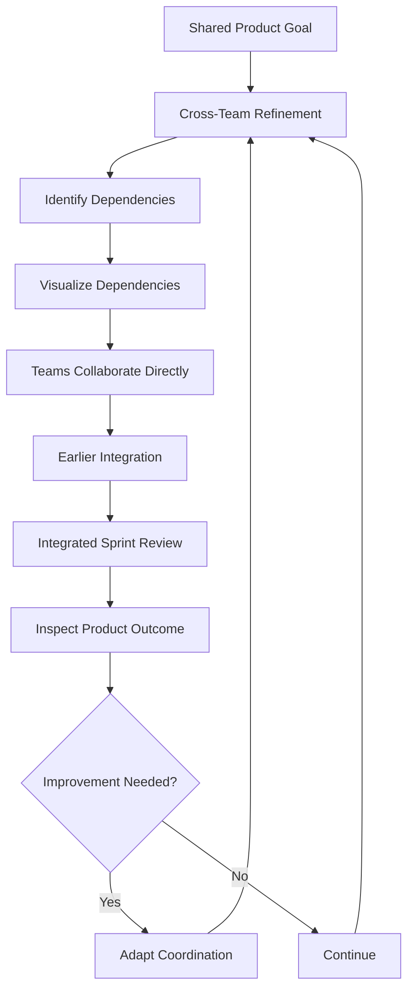

# Case Study 10 — Scaling Agile Across Multiple Teams

> **Portfolio Simulation**  
> Scenario-based case study designed to demonstrate Scrum Master problem-solving, cross-team collaboration, dependency management, and Agile scaling thinking. Not a claim of specific client, employer, or production experience. Metrics and outcomes are illustrative.

---

## 1. Scenario

A product is being developed by multiple Scrum Teams:

- **Team A → Mobile**
- **Team B → Backend**
- **Team C → Payments**
- **Team D → Data**

Each team has its own backlog, Sprint, and day-to-day activities.

However, the product release frequently faces problems because the teams have dependencies on one another.

For example:

**Mobile → Backend → Payments → Data**

A team may complete its own work but still be unable to deliver a usable product increment because another team's dependency is incomplete.

Typical concerns may include:

> "Our development is complete, but the Backend API is not ready."

> "The Payments integration is still pending."

> "The Data team needs changes from another team before testing can begin."

> "Each team completed its Sprint, so why did the product release fail?"

The challenge is therefore not simply individual team performance.

It is a **product-level coordination and dependency problem**.

---

## 2. Business / Delivery Impact

When multiple teams work independently without sufficient product-level coordination, several problems can occur:

- Dependencies are discovered late
- Teams spend time waiting for other teams
- Integration happens near the end of the release
- Defects are discovered late
- Teams optimize their own backlog rather than the product outcome
- Sprint completion may not translate into a usable product increment
- Release predictability becomes difficult
- Cross-team communication becomes reactive
- Teams may start adding meetings without addressing the underlying coordination problem

The key question becomes:

> **How can multiple teams coordinate effectively while still maintaining team autonomy and focus?**

The Scrum Master's focus should be on making dependencies and product-level risks transparent and helping the teams collaborate around a shared outcome.

---

## 3. What I Would Observe

Before introducing additional coordination practices, I would inspect how the teams currently work together.

I would look for:

- Whether all teams understand the same Product Goal
- Where dependencies exist between teams
- When dependencies are identified
- Whether dependencies are visible to everyone involved
- Whether teams communicate directly with dependent teams
- How cross-team refinement is handled
- When integration actually happens
- Whether Sprint Reviews provide an integrated view of the product
- Whether the Definition of Done supports a usable Increment
- Where release risks are discovered
- Whether teams optimize for their individual backlog or the overall product outcome

I would map the flow from individual team work to the integrated product outcome.

The objective would be to identify **where coordination breaks down**, rather than simply adding more meetings.

---
## 4. Root Cause Analysis

The initial problem may appear to be:

**"There are too many dependencies between teams."**

But the deeper problem is often the way the teams coordinate around the product.

Possible root causes include:

- Teams have limited visibility into each other's upcoming work
- Dependencies are identified too late
- Teams refine their work independently
- Integration is postponed until late in the release
- Teams have different assumptions about readiness and quality
- Product-level priorities are not sufficiently shared
- Teams optimize their individual Sprint outcomes instead of the overall product outcome
- Cross-team risks are managed reactively rather than proactively

The objective is not to eliminate every dependency.

Some dependencies are natural in complex products.

The objective is to make important dependencies **visible early, discuss them collaboratively, and reduce the impact of waiting and late integration**.

---

## 5. Scrum Master's Approach

### Start With a Shared Product Goal

I would first establish whether the teams have a common understanding of the product outcome they are working toward.

A shared Product Goal helps teams understand how their individual work contributes to the broader product direction.

### 1. Cross-Team Refinement

Where significant dependencies exist, representatives from the relevant teams can collaborate during refinement.

The discussion should identify:

- Dependency
- Owning team
- Dependent team
- Expected timing
- Technical or integration risk
- Alternative approaches

The objective is to discover dependencies **before they become Sprint-level blockers**.

### 2. Dependency Visualization

Create a simple dependency view showing relationships such as:

**Mobile → Backend → Payments → Data**

The visualization should make it easier to see:

- Which team is waiting
- What is being waited for
- Who needs to collaborate
- Which dependency creates the highest delivery risk

The visualization is a transparency mechanism, not a control mechanism.

### 3. Integrated Sprint Reviews

Where appropriate, bring the teams together to inspect the product outcome rather than reviewing each team's work as completely separate pieces.

The conversation should focus on:

> **"What usable product outcome did we create?"**

rather than simply:

> **"What did each team complete?"**

### 4. Definition of Done

Where appropriate, teams can align their understanding of quality and integration expectations.

A shared Definition of Done can help establish a common quality bar when the product context requires it.

The Definition of Done should make the quality expectations transparent rather than becoming a checklist used only for reporting.

### 5. Cross-Team Planning

For work with significant dependencies, the relevant teams should collaborate early enough to understand:

- Integration points
- Sequencing constraints
- Risks
- Dependencies
- Technical assumptions
- Opportunities to reduce coupling

The goal is not to create a centralized command-and-control planning process.

It is to improve coordination while allowing teams to remain self-managing.

### 6. Release Coordination

Release readiness should be inspected at the product level.

Instead of asking only:

> "Did every team complete its Sprint?"

also ask:

> "Is the integrated product outcome ready?"

If the organization genuinely requires a formal scaling approach, I would first understand the organizational context and problem being solved before considering a framework such as **SAFe**.

The presence of multiple teams alone should not automatically trigger adoption of a scaling framework.

---

## 6. Metrics to Inspect

I would use metrics to understand the flow of value across teams rather than to compare or rank teams.

| Metric / Signal | What it helps reveal |
|---|---|
| Cross-team dependencies | Where coordination is required |
| Dependency aging | How long dependencies remain unresolved |
| Blocked time | Impact of waiting on delivery |
| Cycle time | How quickly work moves toward Done |
| Integration defects | Problems discovered during integration |
| Rework | Additional effort caused by late discovery |
| Work item age | Items that may be becoming stuck |
| Sprint Goal achievement | Whether teams are delivering toward meaningful outcomes |
| Release readiness | Whether integrated product outcomes are ready |

The purpose of these metrics is to create **transparency and useful conversations**, not to measure individual or team performance.

---
## 7. Improvement Experiment

### Experiment: Improve Cross-Team Coordination Through Early Visibility

Rather than introducing a large number of new meetings, I would run a focused experiment across the next few Sprints.

### Step 1 — Establish Product-Level Visibility

Create a simple dependency map covering the major relationships between teams.

For example:

**Mobile → Backend → Payments → Data**

For each significant dependency, capture:

- Dependency
- Owning team
- Dependent team
- Expected timing
- Risk
- Status
- Impact

### Step 2 — Identify Dependencies Earlier

During refinement, ask:

> "Which other team needs to be involved for this item to reach Done?"

Dependencies identified early can then be discussed before Sprint execution rather than discovered after work has already started.

### Step 3 — Encourage Direct Collaboration

Instead of routing every dependency through the Scrum Master, encourage the relevant Developers and teams to collaborate directly.

The Scrum Master's role is to facilitate the conversation, remove systemic impediments, and help make risks transparent.

### Step 4 — Integrate Earlier

Where technically and product-wise possible, encourage smaller vertical slices and earlier integration.

This reduces the risk of discovering major integration problems near the end of a release.

### Step 5 — Inspect the Experiment

At the end of each Sprint, inspect:

- Which dependencies were identified early?
- Which dependencies caused waiting?
- Which dependencies were resolved?
- Where did integration fail?
- What can be changed in the next Sprint?

The experiment should be adapted based on evidence rather than becoming another permanent process automatically.

---

## 8. Expected Outcome

The objective is not to eliminate all dependencies.

The objective is to make dependencies **visible, manageable, and less disruptive to product delivery**.

Expected improvements include:

- Earlier identification of cross-team dependencies
- Reduced dependency-related waiting
- Better communication between teams
- Earlier integration
- Earlier discovery of integration issues
- Better understanding of the shared Product Goal
- Improved product-level transparency
- More effective Sprint Reviews
- Better coordination without excessive meetings
- Stronger focus on integrated product outcomes

Over time, the teams should become increasingly capable of coordinating directly rather than depending on the Scrum Master to act as a permanent communication bridge.

---

## 9. Scrum Master Learning

### Key Learning

> **Scaling is not about adding more meetings. It is about improving coordination while maintaining focus on product outcomes.**

When multiple teams work on the same product, simply creating additional ceremonies does not automatically solve the underlying problems.

A Scrum Master should first understand:

- What is preventing effective collaboration?
- Where are dependencies creating delays?
- Where is product-level transparency missing?
- Where is integration happening too late?
- What coordination is genuinely necessary?
- What can be simplified or removed?

The goal is to create enough coordination to support the product while preserving team autonomy and self-management.

If the organization has a genuine need for a scaling framework, the Scrum Master should help the organization understand the problem first and then evaluate appropriate approaches rather than assuming that a framework is required simply because multiple teams exist.

---
## 10. Interview Answer

**Interviewer:**  
"How would you handle dependencies when multiple Scrum Teams are working on the same product?"

**Answer:**

> "I would first make sure the teams have a shared understanding of the Product Goal and the outcome we are trying to achieve. Then I would make significant cross-team dependencies visible and encourage the relevant teams to collaborate early during refinement.
>
> I would look at where dependencies are being discovered, how long they remain unresolved, and where integration is happening too late. Based on that, I might introduce practices such as dependency visualization, cross-team refinement for relevant work, integrated Sprint Reviews, aligned quality expectations where appropriate, and earlier integration.
>
> I would also encourage the teams to communicate directly rather than making the Scrum Master the communication bridge for every dependency.
>
> I would use metrics such as dependency aging, blocked time, cycle time, integration defects, and release readiness to inspect whether the changes are actually improving the flow of value.
>
> If the organization genuinely needed a scaling framework, I would first understand the problem and context before evaluating an approach such as SAFe. I would not introduce a scaling framework simply because multiple teams exist.
>
> My focus would be on improving coordination while maintaining team autonomy and keeping everyone aligned toward the product outcome."

---

## 11. Visual

### Key Idea

**Shared Goal → Early Visibility → Collaboration → Integration → Inspection → Adaptation**

Effective scaling is about improving the flow of value across teams, not simply increasing the number of coordination meetings.

---

## 12. Portfolio Takeaway

### What This Case Demonstrates

**Primary Skills**
- Cross-Team Collaboration
- Dependency Management
- Systems Thinking
- Agile Scaling

**Supporting Skills**
- Facilitation
- Product Goal Alignment
- Risk Management
- Impediment Removal
- Stakeholder Collaboration
- Continuous Improvement
- Metrics and Transparency
- Release Coordination

### Scrum Master Mindset

> **Think beyond individual team success and help the organization optimize for the product outcome.**

When several teams contribute to the same product, a team completing its own work does not automatically mean the product outcome is ready.

The Scrum Master's role is to help make dependencies, risks, integration challenges, and product-level outcomes transparent so that teams can collaborate and adapt.

**Scaling should solve a real problem—not create additional process.**

---
