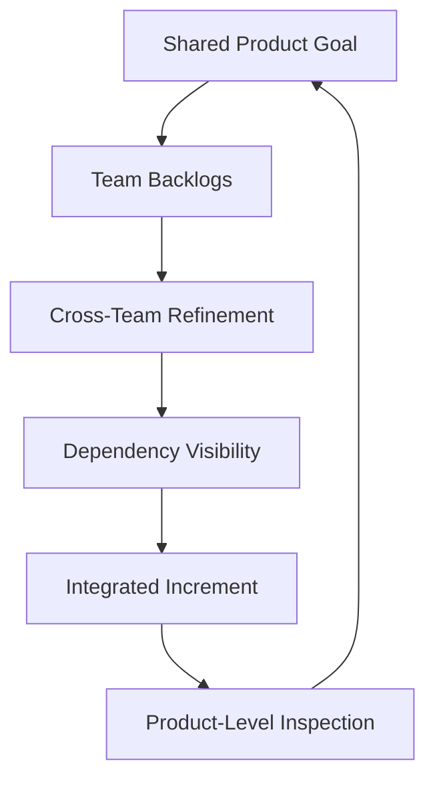

# Scaling Agile Across Multiple Teams

**Primary Skill:** Cross-Team Collaboration

> **Portfolio case study:** This is a realistic simulation intended to demonstrate Scrum Master problem-solving. It should not be presented as a claim of specific client/project experience.

## 1. Scenario

A product is delivered by several teams working on mobile, backend, payments, and data. Each team performs reasonably well, but the integrated product frequently misses release expectations.

## 2. Business / Delivery Impact

Local team optimization does not translate into product-level predictability because dependencies, integration points, and shared priorities are poorly coordinated.

## 3. What I Would Observe

- Cross-team dependencies
- Different priorities
- Late integration
- Separate reviews
- Inconsistent quality expectations

## 4. Root Cause Analysis

The primary issue is coordination around the product outcome. Scaling should solve a real coordination problem rather than add ceremonies for their own sake.

## 5. Scrum Master's Approach

Establish a shared Product Goal and improve cross-team backlog refinement. Visualize dependencies, coordinate integration, use integrated Sprint Reviews, and strengthen shared quality expectations where appropriate. If the organization adopts a scaling framework such as SAFe, use it intentionally to address specific coordination needs rather than treating the framework as the solution by itself.

## 6. Metrics to Inspect

- Product Goal achievement
- Cross-team blocked time
- Dependency age
- Integration frequency
- Release predictability
- Escaped defects

## 7. Improvement Experiment

The team would agree on a small, measurable experiment rather than introducing a large process change all at once.

```text
Problem → Hypothesis → Experiment → Measure → Inspect → Adapt
```

## 8. Expected Outcome

Teams retain ownership while cross-team coordination and product-level visibility improve.

## 9. Scrum Master Learning

Scaling is not simply adding more meetings. It is reducing organizational friction around a shared product outcome.

## 10. Interview Answer

“I would first understand the scaling problem before introducing a framework. I would focus on product-level goals, dependency visibility, integration, and cross-team collaboration. A scaling framework can then be evaluated where it genuinely addresses the organization’s needs.”

## 11. Visual



## 12. Portfolio Takeaway

> **The Scrum Master creates the conditions for the team to solve the problem; the Scrum Master does not become the team's problem solver.**
