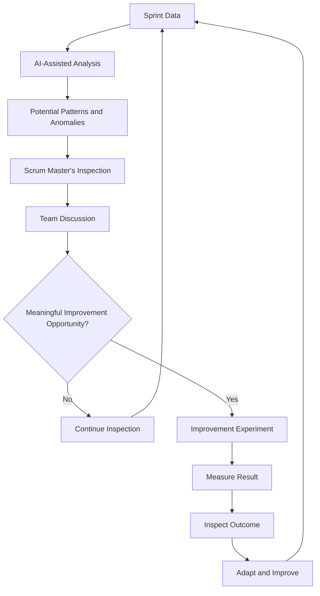

# Case Study 11 — AI-Assisted Scrum Master

> **Portfolio Simulation**  
> Scenario-based case study designed to demonstrate AI-assisted Scrum Master practices, data-informed inspection, facilitation, and continuous improvement. Not a claim of specific client, employer, or production experience. AI outputs, metrics, and outcomes shown in this case study are illustrative.

---

## 1. Scenario

A Scrum Master spends significant time manually analyzing information from different sources:

- Sprint metrics
- Retrospective notes
- Blockers
- Action items
- Team sentiment
- Dependencies

As the amount of information increases, manually identifying recurring patterns and potential risks can become time-consuming.

For example, a Scrum Master may have to review:

- Multiple Sprint reports
- Retrospective notes from several Sprints
- Repeated impediments
- Carryover work
- Cycle-time trends
- Dependency updates
- Previous improvement actions

The challenge is not simply collecting more data.

The challenge is turning available information into **useful insights that support better conversations and improvement experiments**.

AI can assist with this analysis.

However, the Scrum Master's role remains essential for understanding context, validating AI-generated insights, facilitating conversations, and helping the team decide what to improve.

---

## 2. Business / Delivery Impact

When useful information is spread across multiple sources, several challenges can occur:

- Important patterns may be noticed late
- Repeated impediments may not receive enough attention
- Retrospective themes may be difficult to compare across Sprints
- Action items may lose visibility
- Emerging delivery risks may not be identified early
- Scrum Masters may spend excessive time preparing reports instead of coaching
- Teams may receive metrics without meaningful context
- Data may be interpreted incorrectly if context is ignored

AI-assisted analysis can potentially reduce the manual effort involved in organizing and identifying patterns.

The objective is not to automate Scrum Master decision-making.

The objective is to help the Scrum Master **inspect information more efficiently and use the resulting insights to facilitate better conversations**.

---

## 3. What I Would Observe

Before introducing AI into the workflow, I would understand the existing process.

I would inspect:

- What Sprint data is already available
- Which metrics are being reviewed
- How Retrospective notes are captured
- How blockers are tracked
- How dependencies are documented
- How improvement actions are followed up
- Which analysis activities consume the most time
- Which patterns are difficult to identify manually
- Where AI could assist without compromising confidentiality or trust

I would also establish clear boundaries around AI usage.

For example:

- Do not expose confidential information unnecessarily
- Do not treat AI-generated interpretations as facts
- Do not use AI to assess individual performance
- Do not use AI sentiment analysis as a substitute for direct team conversations
- Validate important observations with the team and available evidence

The starting point should be:

> **Use AI to assist inspection, not to replace inspection.**

---
## 4. Root Cause Analysis

The initial problem may appear to be:

**"The Scrum Master needs better metrics analysis."**

But the deeper challenge is often the amount of information that must be inspected across different sources.

Important patterns may exist across multiple Sprints without being immediately obvious.

For example:

- Carryover may gradually increase
- Cycle time may trend upward
- The same blocker may appear repeatedly
- Work in progress may remain high
- The same retrospective theme may recur
- Dependencies may repeatedly cause delays
- Improvement actions may remain incomplete

AI can help organize and summarize this information and identify potential patterns or anomalies.

However, AI-generated insights can lack important context.

A metric may change because of:

- A production incident
- A change in team composition
- A large technical item
- External dependencies
- Planned experimentation
- Product or priority changes

Therefore, AI analysis should be treated as a **starting point for inspection**, not as the final conclusion.

---

## 5. Scrum Master's Approach

### AI-Assisted Inspection Workflow

I would use the following workflow:

**Sprint Data**

↓  

**AI-Assisted Analysis**

↓

**Potential Patterns / Anomalies**

↓

**Scrum Master's Inspection**

↓

**Team Discussion**

↓

**Improvement Experiment**

↓

**Measure Result**

The Scrum Master remains accountable for interpreting the information in context and facilitating the conversation with the team.

### 1. Retrospective Analysis

AI can assist by clustering recurring themes across retrospective notes.

For example:

| Sprint | Theme |
|---|---|
| Sprint 1 | Environment instability |
| Sprint 2 | Environment instability |
| Sprint 3 | Late dependency information |
| Sprint 4 | Environment instability |

AI may identify **environment instability** as a recurring theme.

The Scrum Master would then validate this observation with the team.

The question becomes:

> "Is this actually a recurring problem, and what impact is it having?"

The team decides what, if anything, to improve.

### 2. Sprint Risk Detection

AI can assist in identifying potential signals such as:

- Increasing carryover
- Growing cycle time
- Excessive Work in Progress
- Repeatedly blocked stories
- Increasing rework
- Recurring dependencies

These signals should then be inspected against the actual Sprint context.

### 3. Action-Item Tracking

AI can help organize retrospective outcomes into a structured format:

| Action | Owner | Due Date | Expected Outcome | Status |
|---|---|---|---|---|
| Improve dependency visibility | Team | Next Sprint | Earlier dependency identification | Open |
| Review environment issue | Developers | Next Sprint | Reduce environment-related delays | In Progress |

The Scrum Master would validate the action items with the team rather than allowing AI to assign ownership automatically.

---

## 6. Metrics to Inspect

AI-assisted analysis can be applied to several useful signals:

| Metric / Signal | Potential Insight |
|---|---|
| Sprint carryover | Possible planning, dependency, or execution issues |
| Cycle time | Changes in work-flow efficiency |
| Work in Progress | Possible bottlenecks or excessive parallel work |
| Blocked time | Impact of impediments |
| Dependency aging | Cross-team coordination risks |
| Defects / rework | Potential quality concerns |
| Retrospective themes | Recurring improvement opportunities |
| Action-item completion | Whether improvement experiments are progressing |

These metrics should not be treated as isolated indicators.

The Scrum Master should combine **data + context + team conversation** before drawing conclusions.

---
## 7. Improvement Experiment

### Experiment: AI-Assisted Sprint Inspection

I would introduce AI gradually rather than attempting to automate the entire Scrum Master's workflow.

### Step 1 — Collect Relevant Data

Use available Sprint information such as:

- Sprint metrics
- Blocker information
- Dependency data
- Retrospective themes
- Improvement actions

Only appropriate and authorized information should be provided to the AI tool.

### Step 2 — Ask AI to Identify Signals

AI can be asked to:

- Summarize recurring themes
- Identify potential trends
- Group similar blockers
- Highlight unusual changes
- Organize action items
- Identify repeated dependency patterns

### Step 3 — Inspect the AI Output

The Scrum Master reviews the output and asks:

- Is the observation supported by the data?
- Is important context missing?
- Is the AI interpreting correlation as causation?
- Is this actually a recurring pattern?
- Could there be another explanation?

### Step 4 — Validate With the Team

Potential insights are brought into the appropriate team conversation.

For example:

> "The last three Sprints show repeated environment-related blockers. Does this reflect what the team is experiencing?"

The team provides the context that the data alone cannot provide.

### Step 5 — Run One Improvement Experiment

If the team identifies a meaningful problem, select a focused improvement experiment.

For example:

**Problem:** Repeated environment-related blockers

**Experiment:** Establish an environment readiness check before Sprint execution.

### Step 6 — Measure the Result

After the experiment, inspect whether the expected improvement occurred.

The cycle becomes:

**Generate → Inspect → Identify Gaps → Adapt → Improve**

AI assists with the analysis, while the Scrum Master and team remain responsible for understanding and acting on the results.

---

## 8. Expected Outcome

The expected outcome is not:

> "AI manages the Scrum process."

Instead, the goal is to make inspection more efficient and create better opportunities for meaningful improvement.

Potential benefits include:

- Faster identification of recurring patterns
- Less manual effort in organizing information
- Better visibility into repeated blockers
- More structured retrospective analysis
- Improved action-item visibility
- Earlier identification of potential delivery risks
- More data-informed team conversations
- More consistent follow-up on improvement experiments

The quality of the outcome still depends on the quality of the underlying data, the AI analysis, Scrum Master's validation, and team context.

---

## 9. Scrum Master Learning

### Key Learning

> **AI should assist the Scrum Master—not replace human facilitation, coaching, empathy, or decision-making.**

AI can process information quickly, but it does not automatically understand:

- Team dynamics
- Organizational context
- Stakeholder relationships
- Emotional signals
- Historical circumstances
- The reasons behind a metric change
- What the team is actually experiencing

The Scrum Master's value therefore does not disappear when AI is introduced.

Instead, the Scrum Master can spend less time on repetitive analysis and more time on:

- Coaching
- Facilitation
- Building trust
- Removing systemic impediments
- Helping teams inspect their way of working
- Supporting meaningful conversations
- Enabling continuous improvement

The objective is not **AI replacing the Scrum Master**.

It is **AI augmenting the Scrum Master's ability to inspect and improve**.

---
## 10. Interview Answer

**Interviewer:**  
"How would you use AI as a Scrum Master?"

**Answer:**

> "I would use AI as an assistant for analysis rather than as a replacement for Scrum Master responsibilities.
>
> For example, I could use AI to analyze Sprint data, retrospective themes, blockers, dependencies, and improvement actions to identify recurring patterns or potential anomalies.
>
> If AI identified increasing carryover or recurring blockers, I would not immediately treat that as a conclusion. I would inspect the underlying data, consider the context, and then discuss the observation with the team.
>
> If the team agreed that there was a meaningful problem, we could select a focused improvement experiment and measure the result in subsequent Sprints.
>
> I would also use AI to organize retrospective themes and action items, while ensuring that ownership and decisions remain with the people involved.
>
> My principle would be: AI assists with analysis, but the Scrum Master remains responsible for facilitation, coaching, context, and helping the team make informed decisions.
>
> In short, I see AI as a tool that can reduce repetitive analysis and give the Scrum Master more time to focus on people, collaboration, and continuous improvement."

---

## 11. Visual

### Key Idea

**AI assists analysis. Humans provide context, judgment, coaching, and decisions.**

The improvement loop remains:

**Generate → Inspect → Identify Gaps → Adapt → Improve**

---

## 12. Portfolio Takeaway

### What This Case Demonstrates

**Primary Skills**
- AI-Assisted Agile Practices
- Data-Informed Inspection
- Scrum Master Coaching
- Continuous Improvement

**Supporting Skills**
- Sprint Metrics
- Retrospective Facilitation
- Risk Identification
- Impediment Management
- Dependency Management
- Action-Item Tracking
- Team Collaboration
- AI Output Validation

### AI-Enabled Scrum Master Mindset

> **Use AI to reduce repetitive analysis so that more human attention can be invested where it matters most: people, context, collaboration, and continuous improvement.**

AI can help identify patterns.

The Scrum Master helps determine whether those patterns actually matter.

AI can organize information.

The Scrum Master facilitates the conversation around that information.

AI can suggest possibilities.

The team and Scrum Master inspect the evidence, consider the context, and decide what to do.

### The Principle

**AI should augment—not replace—the Scrum Master's human capabilities.**

The strongest AI-assisted workflow is not:

**Data → AI → Decision**

It is:

**Data → AI-assisted analysis → Human inspection → Team discussion → Improvement experiment → Measurement**

---
