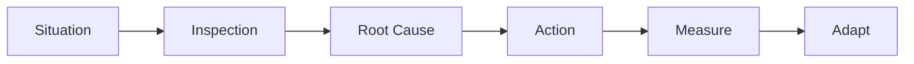

# Scrum Master Case Study Template

> Use this template for a real or simulated scenario. Clearly label simulations and anonymize real project details.

## 1. Scenario

## 2. Business / Delivery Impact

## 3. What I Would Observe

## 4. Root Cause Analysis

## 5. Scrum Master's Approach

## 6. Metrics to Inspect

## 7. Improvement Experiment

## 8. Expected Outcome

## 9. Scrum Master Learning

## 10. Interview Answer

## 11. Visual

